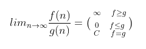

# Въведение, преговор и сложности

## Въведение

### Защо са важни структурите от данни и алгоритмите?

- Развиване на problem-solving skills и аналитично мислене
- Задължителна част от интервютата за работа ("whiteboard interviews")
  - Анализиране на проблем
  - Разработване на решение
  - Извличане на тестови сценарии
  - Тестване на решението
  - Оценка на решението
- Придобиване на разбиране за това как са имплементирани готовите структури в езиците, които използваме ежедневно. Така можем да оценим:
  - каква е тяхната очаквана производителност?
  - как скалират при нарастване на данните?
- В ерата на AI: инструментите пишат код, но вие отговаряте за него. DSA ви дава способността да оцените, проверите и подобрите генерираното решение, вместо сляпо да му се доверите.

## Преговор и запознаване със стандартната библиотека

<details>
  <summary>C++</summary>

### Поинтъри и референции

- Поинтър
  - съдържа адреса на една променлива
  - може да има нулева стойност (`nullptr`)
  - може да променя стойността си (да сочи към друго място)
- Референция
  - "псевдоним" на съществуваща променлива
  - веднъж инициализирана, не може да бъде пренасочена към друга променлива

### Типове данни

| Data Type   | Size    | Size (bits) | Signed Value Range                                       | Unsigned Value Range            |
| ----------- | ------- | ----------- | -------------------------------------------------------- | ------------------------------- |
| `char`      | 1 byte  | 8 bits      | -128 to 127                                              | 0 to 255                        |
| `bool`      | 1 byte  | 8 bits      | `true` (1) or `false` (0)                                | N/A                             |
| `short`     | 2 bytes | 16 bits     | -32,768 to 32,767                                        | 0 to 65,535                     |
| `int`       | 4 bytes | 32 bits     | -2,147,483,648 to 2,147,483,647                          | 0 to 4,294,967,295              |
| `long`      | 4 bytes | 32 bits     | -2,147,483,648 to 2,147,483,647                          | 0 to 4,294,967,295              |
| `long long` | 8 bytes | 64 bits     | -9,223,372,036,854,775,808 to 9,223,372,036,854,775,807  | 0 to 18,446,744,073,709,551,615 |
| `float`     | 4 bytes | 32 bits     | Approximately ±3.4E−38 to ±3.4E+38 (7 decimal places)    | N/A                             |
| `double`    | 8 bytes | 64 bits     | Approximately ±1.7E−308 to ±1.7E+308 (15 decimal places) | N/A                             |

Формулите са: от -2<sup>n-1</sup> до 2<sup>n-1</sup> - 1 за *signed* типовете и от 0 до 2<sup>n</sup> - 1 за *unsigned* типовете, където n е броят на битовете.

Често срещани грешки:

- overflow при събиране на int-ове
- сравняване на double-и с ==
  - **Бонус:** Как работят float и double, за да разберете защо не трябва да ги сравняваме с == - [тук](https://fabiensanglard.net/floating_point_visually_explained/?fbclid=IwAR1lwXOIifhzJmXkx49eniqaHE1iI7-MB6ofwR5mHgFOOO_NJWn-WxXbQBk)
- подаване на vector/string и други структури по копие, а не по референция - води до ненужно копиране на данни и загуба на производителност
  - все пак в някакви случаи може и да е оправдано, в случай че искаме копие на данните
  - изпробвайте примера от файла - [тук](./Revision/CopyRefRvalue.cpp)

### Масиви и матрици

- A[] vs A*[]
- A[][] vs A**

### Рекурсия (pros and cons)

- [Рекурсия](https://www.informatika.bg/lectures/recursion)

### Базово запознаване със структури от STL

- std::string
  - **Бонус:** Как е оптимизиран std::string за малки низове? (small string optimization)
- std::vector
  - **Бонус:** Каква е имплементацията на темплейтната специализация `std::vector<bool>`? (bitset)
  - **Бонус:** Защо, ако ползвам std::vector с дефиниран от мен клас, който няма default constructor, това не пречи на std::vector?
- std::pair
- iterators
- range-based for loop (also known as for-each)
- auto keyword
- std::swap, std::min, std::max, std::reverse ...

</details>

---

<details>
  <summary>Python</summary>

### Основни концепции

- За преговор на основни принципи в Python, разгледайте тетрадката към този семинар: [тук](./playground_01.ipynb)
  - Като за начало можете да клонирате това репо ([ръководство](https://docs.github.com/en/repositories/creating-and-managing-repositories/cloning-a-repository)) или да изтеглите ръчно тетрадката, посочена в линка.
  - Как да работите с Jupyter тетрадка във VS Code, прочетете [тук](https://code.visualstudio.com/docs/datascience/jupyter-notebooks)! (Силно препоръчително умение за Data Analyst!)
- За да видите как се чете входът в HackerRank, погледнете различните решения на тези две задачи: [решения на задача 1]() и [решения на задача 2]()
  
</details>


## Запознаване с HackerRank и LeetCode

- <https://www.hackerrank.com/>
  - За изпробване на хакеранк [Solve Me First](https://www.hackerrank.com/challenges/solve-me-first/problem)
- <https://leetcode.com/>

**Note:** И двете платформи използват gcc компилатора!

### Какво ни дават?

- Предварително зададени тестове.
- Автоматично оценяване на решенията.
- Неограничен брой опити за предаване на решение.
- Получавате точките от най-добрия резултат измежду всички предадени решения.
- Дори решението да не покрива 100% от тестовете, получавате точките за тестовете, които покрива.
- Автоматичните тестове не могат да се виждат, преди да е приключило домашното.
- Възможност за собствено тестване преди предаване.

### Различните грешки при изпълнение на автоматичен тест

- Wrong Answer - логическа грешка в алгоритъма.
- Runtime Error - възникване на грешка по време на изпълнение.
- Terminated due to timeout - бавен, неподходящ алгоритъм.
- Memory Limit - изчерпване на паметта.
- Abort Called - грешка от ниско ниво (в C++, напр. std::abort(), failed assert, bad_alloc).
- Segmentation Fault - опит за достъп до памет, която е недостъпна.

[HackerRank cheatsheet](./HackerrankHacks)

### Важно за HackerRank и LeetCode в рамките на курса

- **Само и единствено при решаване на задачи в LeetCode и HackerRank в рамките на курса** няма да освобождаваме динамичната памет, а по-големите обекти ще заделяме като глобални – единствено с цел бързодействие на кода и да не препълваме стека. В реални условия това е изключително лоша практика.
- **Само и единствено при решаване на задачи в LeetCode и HackerRank в рамките на курса** не е важно code quality-то стига тестовете да минават успешно

## Структури от данни и алгоритми

- Алгоритъм наричаме крайна последователност от стъпки, които водят до решаването на дадена задача.

- Структура от данни е организирана информация, която може да се опише, създаде и обработи с помощта на програма.

## Сложности

Сложност - функция, която описва как се изменя количеството необходими ресурси (най-често време и памет) в зависимост от големината на входа n.

- **Сложност по време**
  - функция на входа n, която описва броя на основните операции, които алгоритъмът извършва.
  - Best, Worst, Average, Amortized
- **Сложност по памет**
  - функция на входа n, която описва количеството памет, необходимо за изпълнението на алгоритъма.
  - Best, Worst, Average, Amortized
- **Амортизирана сложност** е средната цена на една операция, пресметната върху **последователност от операции** в най-лошия случай.
  - **Средната сложност** е очакваната цена на алгоритъма, усреднена по всички възможни входове според вероятността им. **Амортизираната сложност** разглежда последователност от операции върху един и същ вход: отделна операция може да е скъпа, но тъй като такива операции са редки, общата цена на n операции, разделена на n, е по-малка от цената на една операция в най-лошия случай.
  - **Пример:** добавяне на елемент в края на динамичен масив (`std::vector::push_back`) е **амортизирано O(1)**, въпреки че отделно добавяне може да струва O(n).

<details>
  <summary><b>Изчисление за push_back</b></summary>

- Ако масивът е пълен, заделяме нов масив с **двоен капацитет**, копираме всички стари елементи и записваме новия: цена **k + 1**, където k е текущият брой елементи.
- Нека започнем с капацитет 1 и направим n добавяния. Разширяване има, когато размерът достигне 1, 2, 4, 8, …, т.е. най-много при степените на двойката до n.
  - Записи на нови елементи: **n*1=n**
  - Копирания при разширяване: *1 + 2 + 4 + … + 2<sup>⌊log n⌋</sup> < 2n*
  - Обща цена: *T(n) < n + 2n = 3n*
- Амортизирана цена на една операция: *T(n) / n < 3 = O(1)*.

</details>

### Big O notation

Big O нотацията описва **асимптотична горна граница** на скоростта, с която нараства една функция при достатъчно големи стойности на n. Константните множители и по-бавно растящите събираеми не се вземат предвид, затова функции с еднакъв порядък на растеж се записват с една и съща Big O нотация (например *3N<sup>2</sup> + 5N + 7 = O(N<sup>2</sup>)*).

<details>
  <summary><b>В дълбочина</b></summary>

- **Горна граница** означава, че *f(n) ≤ g(n)* за всяко n, без изключения и без константа.
- **Асимптотична горна граница** (Big O) означава, че *f(n) ≤ c·g(n)* за всяко *n ≥ n₀*, т.е. само от някое място нататък и с право да умножим g по константа c.
  - Формално: *f(n) = O(g(n))*, ако съществуват константи *c > 0* и *n₀*, такива че *f(n) ≤ c·g(n)* за всяко *n ≥ n₀*.
  - Пример: *3n + 100 ≤ n* не е вярно за нито едно n, но с *c = 4* и *n₀ = 100* имаме *3n + 100 ≤ 4n* за всяко *n ≥ 100*, т.е. *3n + 100 = O(n)*.

</details>

**Бонус:** има и други нотации, които показват различни граници: горна (O), долна (Ω) или точна (Θ).

- [cheatsheet](https://www.bigocheatsheet.com/)

### Основни сложности

- константна - *O(1)*
- логаритмична - *O(logN)*
- линейна - *O(N)*
- енлог - *O(NlogN)*
- квадратична - *O(N<sup>2</sup>)*
- кубична - *O(N<sup>3</sup>)*
- експоненциална - *O(c<sup>N</sup>)*

Ред на нарастване на времето:

>*1 < logN < sqrtN < N < NlogN < N<sup>2</sup> < N<sup>3</sup> < 2<sup>N</sup> < 3<sup>N</sup> < N! < N<sup>N</sup>*

- Как сравняваме сложности? (как сравняваме две функции f и g)




### Правила за смятане на Big O изрази

- константите, които са множители, не влияят.
  > *O(100N) = O(N)*

- при сбор влияе само най-бързо растящото събираемо.
  > *O(N<sup>2</sup> + NlogN + N + 1) = O(N<sup>2</sup>)*

- при произведение влияят всички множители.
  > *O(N<sup>2</sup> log<sup>3</sup>N)* не може да бъде опростено.

- основата на логаритъма не влияе.
  > *O(log<sub>2</sub>N) = O(log<sub>3</sub>N)*

    Изписва се просто *O(logN)*.
    Това не важи за степента на логаритъма (вж. горния пример).

---

Примери:

- *O(2N) = O(N) = O(10000N)*
- *O(10000000) < O(logN)*
- *O(N + M)*

Когато не може да се определи коя от величините *N* и *M* е по-голяма, изразът *O(N + M)* не може да бъде опростен. В случай, че N нарастваше по-бързо от M можеше да опростим до *O(N)*

<details>
  <summary><b>Каква разлика прави сложността? (практичен пример)</b></summary>

Нека имаме 2 компютъра. Компютър А е най-бързият за времето си, с производителност 10 милиарда операции в секунда. Компютър Б е обикновен компютър и изчислява 10 милиона операции в секунда.

Задачата на компютрите е да сортират масив с 10 милиона елемента.

Машина А използва Insertion sort със сложност *2N<sup>2</sup>*. Машина Б използва Merge sort със сложност *50NlogN*.

За колко време всяка машина ще се справи със задачата?

Суперкомпютър А:

- S<sub>1</sub> = 2N<sup>2</sup> стъпки, за N = 10<sup>7</sup>
- V<sub>1</sub> = 10<sup>10</sup> стъпки/сек.
- => t<sub>1</sub> = 20000 сек. = ~5.5 ч.

Компютър Б:

- S<sub>2</sub> = 50NlogN стъпки, за N = 10<sup>7</sup>
- V<sub>2</sub> = 10<sup>7</sup> стъпки/сек.
- => t<sub>2</sub> = ~1163 сек. = ~20 мин.

Въпреки разликата в производителността и константите в алгоритмите (*2 и 50*), резултатите са коренно различни.

Още по-съществена разлика се наблюдава при увеличаване на големината на масива 10 пъти. При N = 100 милиона числа компютър **А** отнема **23 дни**, а компютър **Б** - **4 часа**.

</details>

### Как изчисляваме сложността на алгоритмите

При итеративни алгоритми (for/while/do-while) сложността по време обикновено се определя от броя на вложените цикли и броя на итерациите им.

При рекурсивните алгоритми сложността по време обикновено се определя от броя на рекурсивните извиквания и сложността на всяко извикване. Един от най-лесните начини за пресмятане на сложността е чрез анализ на рекурсивното дърво на изпълнение.

### Изчислете сложностите по време и по памет на следните алгоритми

<details>
  <summary>C++</summary>

```c++
int f(int n) {
 int result = 0;
 for (size_t i = 0; i < 32; i++) {
  result += n;
 }
 return result;
}
```

<details>
  <summary>Отговор</summary>
  Time Complexity: O(1)

  Space Complexity: O(1)
  
  Защо?
</details>

```c++
int f(int n) {
 int arr[INT_MAX];
 arr[1] = 1;
 arr[2] = 2;
 return 1;
}
```

<details>
  <summary>Отговор</summary>
  Time Complexity: O(1)

  Space Complexity: O(1)
  
  Защо? Но на практика правилно ли е да го правим?
</details>

```c++
int f(int n) {
 int result = 1;
 for (size_t i = 0; i < INT_MAX; i++) {
  result += i;
 }
 return 1;
}
```

<details>
  <summary>Отговор</summary>
  Time Complexity: O(1)

  Space Complexity: O(1)
  
  Защо? Но на практика правилно ли е да го правим?
</details>

```c++
int f(int n) {
 int result = 1;
 for (size_t i = 1; i < n; i *= 2) {
  result += i;
 }
 return 1;
}
```

<details>
  <summary>Отговор</summary>
  Time Complexity: O(log N)

  Space Complexity: O(1)
  
  Защо?
</details>

```c++
int fibonacci(int n) {
 if (n <= 1) {
  return n;
 }

 return fibonacci(n - 1) + fibonacci(n - 2);
}
```

<details>
  <summary>Отговор</summary>
  Time Complexity: *O(2<sup>N</sup>)*

  Обяснение: Всяко извикване създава 2 нови извиквания, всяко от които създава още 2 и т.н. Дървото на рекурсията има дълбочина N, а броят на възлите се удвоява (почти) на всяко ниво, така че те са най-много 2<sup>N</sup>. (Реално е O(1.618^n), но няма да задълбаваме в това тук)

  Space Complexity: *O(N)* - максималната дълбочина на стека на рекурсията.
  
  Защо? Как можем да го направим за *O(N)* време?
</details>

```c++
void permute(std::string s, int left, int right) {
 if (left == right) {
  std::cout << s << std::endl;
  return;
 }

 for (int i = left; i <= right; i++) {
  swap(s[left], s[i]);
  permute(s, left + 1, right);
  swap(s[left], s[i]);
 }
}
```

<details>
  <summary>Отговор</summary>
  Time Complexity: *O(n!)*

  Space Complexity: *O(s.size())*
  
  Защо?
</details>

```cpp
void brothers(int N, int M) {
 for (int i = 0; i < N; ++i) {
  std::cout << i << std::endl;
 }

 for (int j = 0; j < M; ++j) {
  std::cout << j << std::endl;
 }
}
```

<details>
  <summary>Отговор</summary>
  Time Complexity: *O(N + M)* - обхождане на масив с големина *N* и масив с големина *M*.

  Space Complexity: *O(1)*
  
  Защо?
</details>

```cpp
void example2(std::vector<int>& arr) {
 size_t n = arr.size();
 for (auto& el : arr) {
  for (size_t i = 1; i <= n; i++) {
   if ((el + i) % 2 == 0) {
    break;
   }
  }
 }
}
```

<details>
  <summary>Отговор</summary>
  Time Complexity: *O(N)*

  Обяснение: Преминаваме през всеки един от елементите на колекцията (тя има n елемента). За всеки елемент вътрешният цикъл ще се изпълни 1 или 2 пъти в зависимост от четността им (тоест константен брой). Така получаваме линейна сложност.

  Space Complexity: *O(1)*
  
  Защо? Вложен цикъл не означава автоматично *O(N<sup>2</sup>)*!
</details>

```cpp
unsigned example6(unsigned n) {
 if (n <= 1) {
  return 1;
 }

 return example6(n / 2) + example6(n / 2);
}
```

<details>
  <summary>Отговор</summary>
  Time Complexity: *O(N)*

  Обяснение: Функцията връща 1 за `n <= 1`. Иначе вика **себе си два пъти** с `n / 2` и събира резултатите. Самият резултат е без значение (това е най-голямата степен на 2, която е ≤ n). Важното е колко извиквания се правят.

  Капанът е, че `n` се дели на 2 и затова изглежда като *O(logN)*. Но всяко извикване се разклонява на **две**, така че броят на извикванията се удвоява на всяко ниво. Пример с n = 8:

```text
ниво 0:              e(8)                  1 извикване
ниво 1:       e(4)          e(4)           2 извиквания
ниво 2:    e(2)  e(2)    e(2)  e(2)        4 извиквания
ниво 3:   e(1)e(1)e(1)e(1)e(1)e(1)e(1)e(1) 8 извиквания
```

- Дълбочината на дървото е log<sub>2</sub>(n), защото `n` се дели на 2, докато стигне 1.
- На ниво k има 2<sup>k</sup> извиквания, а на последното ниво те са 2<sup>log<sub>2</sub>(n)</sup> = n.
- Общо: 1 + 2 + 4 + ... + n ≈ **2n - 1** извиквания.
- Всяко извикване върши константна работа: едно сравнение и едно събиране.

  Следователно времето е *O(N)*.

  Space Complexity: *O(logN)* - максималната дълбочина на стека на рекурсията.
  
  Защо? Как можем да го направим за *O(logN)* време?

</details>

</details>

---

<details>
  <summary>Python</summary>
  
*O(1)* - връщането на константа:
  
```python
def get_Pi():
 return 3.14
```

*O(1)* - връщането на елемент от масив:
  
```python
def get_6th_element(arr):
 return arr[5]
```

Защо това е така:

- <https://stackoverflow.com/questions/37350450/why-is-a-list-access-o1-in-python>
- <https://softwareengineering.stackexchange.com/questions/252407/why-is-the-complexity-of-fetching-a-value-from-an-array-be-o1>

---

*O(N)* - еднократно обхождане на масив с големина *N*.

```python
for el in arr:
 print(el)
```

*O(N<sup>2</sup>)* - обхождане на масив с големина *N* *N* пъти (чрез вложен цикъл). Обхождане на матрица с размер *NxN*.

```python
for i in range(N):
 for j in range(N):
  print(i, j)
```

---

*O(2<sup>N</sup>)* - Намиране на *N*-тото число от редицата на Фибоначи. Всяко извикване на функцията създава 2 нови извиквания, всяко от които създава още 2 и т.н.

```python
def fibonacci(N):
 if N <= 1:
  return N
 return fibonacci(N-1) + fibonacci(N-2)
```

*O(logN)* - Намиране колко пъти числото *N* може да бъде разделено на 2. При всяко рекурсивно извикване числото намалява 2 пъти.

```python
def count_deuces(N, count = 0):
 if N <= 1:
  return count

 count += 1
 return count_deuces(N // 2, count)
```

Как можем да променим функцията, така че да не използва аргумента `count`?

<details>
  <summary>Отговор</summary>

```python
def count_deuces(N):
 if N <= 1:
  return 0

 return count_deuces(N // 2) + 1
```

</details>

---

*O(N + M)* - обхождане на масив с големина *N* и масив с големина *M*.

```python
def brothers(N, M):
 for i in range(N):
  print(i)

 for j in range(M):
  print(j)
```

---

Каква е сложността на следните функции?

```python
def example2(arr):
 n = len(arr)
 for el in arr:
  for i in range(1, n + 1):
   if (el + i) % 2 == 0:
    break
```

<details>
  <summary>Отговор</summary>
  Time Complexity: *O(N)*

  Обяснение: Преминаваме през всеки един от елементите на колекцията (тя има n елемента). За всеки елемент вътрешният цикъл ще се изпълни 1 или 2 пъти в зависимост от четността им (тоест константен брой). Така получаваме линейна сложност.

  Space Complexity: *O(1)*
  
  Защо? Вложен цикъл не означава автоматично *O(N<sup>2</sup>)*!
</details>

```python
def example6(n):
 if n <= 1:
  return 1

 return example6(n // 2) + example6(n // 2)
```

<details>
  <summary>Отговор</summary>
  Time Complexity: *O(N)*

  Обяснение: Функцията връща 1 за `n <= 1`. Иначе вика **себе си два пъти** с `n // 2` и събира резултатите. Самият резултат е без значение (това е най-голямата степен на 2, която е ≤ n). Важното е колко извиквания се правят.

  Капанът е, че `n` се дели на 2 и затова изглежда като *O(logN)*. Но всяко извикване се разклонява на **две**, така че броят на извикванията се удвоява на всяко ниво. Пример с n = 8:

```text
ниво 0:              e(8)                  1 извикване
ниво 1:       e(4)          e(4)           2 извиквания
ниво 2:    e(2)  e(2)    e(2)  e(2)        4 извиквания
ниво 3:   e(1)e(1)e(1)e(1)e(1)e(1)e(1)e(1) 8 извиквания
```

- Дълбочината на дървото е log<sub>2</sub>(n), защото `n` се дели на 2, докато стигне 1.
- На ниво k има 2<sup>k</sup> извиквания, а на последното ниво те са 2<sup>log<sub>2</sub>(n)</sup> = n.
- Общо: 1 + 2 + 4 + ... + n ≈ **2n - 1** извиквания.
- Всяко извикване върши константна работа: едно сравнение и едно събиране.

  Следователно времето е *O(N)*.

  Space Complexity: *O(logN)* - максималната дълбочина на стека на рекурсията.
  
  Защо? Как можем да го направим за *O(logN)* време?

</details>

Изпробвайте функциите с различни параметри в [playground-a](./playground_01.ipynb)

</details>

## Задачи

### Easy

- [Simple Array Sum](https://www.hackerrank.com/challenges/simple-array-sum/problem)
- [Roommates](https://www.hackerrank.com/contests/sda-hw-1-2022/challenges/1-410)
- [Single Number 1](https://leetcode.com/problems/single-number/)
  - Може ли да се реши с O(1) допълнителна памет и O(n) време?
- [Move zeroes](https://leetcode.com/problems/move-zeroes/)
- [Plus one](https://leetcode.com/problems/plus-one/)
  
### Medium

- [Two sum](https://leetcode.com/problems/two-sum/)
  - Какво се променя, ако сортираме масива?
  - Two-pointer technique
- [Number of Islands](https://leetcode.com/problems/number-of-islands/)
- [Rotate Array](https://leetcode.com/problems/rotate-array/)
- [Rotate image](https://leetcode.com/problems/rotate-image/)
- [Container with most water](https://leetcode.com/problems/container-with-most-water/)

### Hard

- [First missing positive](https://leetcode.com/problems/first-missing-positive/)
  - Първо се опитайте да го решите с O(N) време и O(N) памет.

Решения на задачите на C++ и Python можете да намерите в папката [Solutions](./Solutions).

## Quiz

## Бонус

### Теория

- Опашкова рекурсия
  - <https://www.informatika.bg/lectures/recursion>
  - Рекурсия е опашкова, когато рекурсивното извикване е последната операция във функцията (след него няма какво да се изпълни). Така компилаторът (с включени оптимизации, напр. Release / `-O2`) може да превърне рекурсията в цикъл и стекът не расте с дълбочината на рекурсията.
  - изпробвайте примера: [TailRecursion.cpp](./Revision/TailRecursion.cpp)

### Задачи

Majority element - <https://leetcode.com/problems/majority-element/?envType=problem-list-v2&envId=divide-and-conquer>

- Boyer-Moore Majority Voting Algorithm
