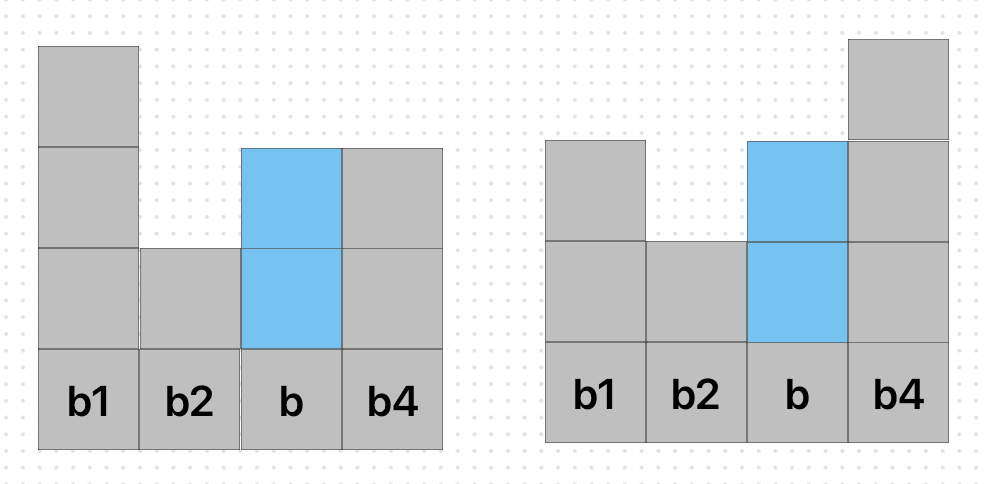
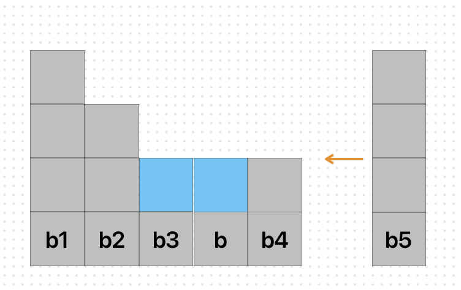
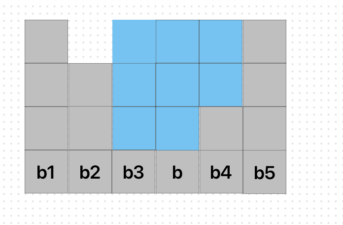

# Задачи

- [Valid Parentheses](https://leetcode.com/problems/valid-parentheses/description/) - Easy
- [Next Greatest Element II](https://leetcode.com/problems/next-greater-element-ii/description/) - Mid
- [Asteroid Collision](https://leetcode.com/problems/asteroid-collision/description/) - Easy/ Mid
- [Shortest Unsorted Continuous Subarray](https://leetcode.com/problems/shortest-unsorted-continuous-subarray/description/) - Mid
- [Removing Stars From a String](https://leetcode.com/problems/removing-stars-from-a-string/description/) - Easy
- [Trapping Rain Water](https://leetcode.com/problems/trapping-rain-water/description/) - Hard
- [Sliding Window Maximum](https://leetcode.com/problems/sliding-window-maximum/description/) - Hard

---

# Обяснения на задачите

## Trapping Rain Water
Дадени са блокчета $b_1, b_2, ..., b_n$ и търсим колко вода може да се събере между тях. Ще го направим като за всяко блокче $b$ видим колко блокчета вода могат да се сложат върху него и накрая ще преброим всички. За да може върху едно блокче $b$ да сложим вода, трябва то да се намира между други две блокчета $b_1$ и $b_4$ например, които са по-високи от него $(b_1 > b, b_4 > b)$:
Блокчетата вода върху $b$ тогава ще са точно $min(b_1, b_4) - b$ на брой:

Тези блокчета може да ги пазим подредени по височина $b_1 \ge b_2 \ge ... \ge b_k$ и когато се появи блокче $b_{k+1} > b_k$, ще може да пресметнем броя блокчета вода върху $b_k$, като после ще *махнем* $b_k$, защото вече сме сметнали водата, и ще продължим с $b_{k-1}$ и т.н. Понеже за пресмятането използваме началното $b_1$, е удобно да пазим блокчетата в намаляващ дек $[b_1, b_2, ..., b_k]$, т.е. $b_1 \ge b_2 \ge ... \ge b_k$.  (Използваме дек, защото искаме да достъпваме най-левия елемент в него и да добавяме и махаме елементи в десния край)

Може обаче да се случи така, че в дека да сме имали $[b_1, b_2, b_3, b]$ и да е дошло блокче $b_4 > b_3 \ge b$, с което ще сметнем водата върху $b$ и $b_3$ (вж. картинката долу - по 1 блокче вода) и в дека ще останат само $[b_1,b_2,b_4]$. В следващия момент може да се появи блокче $b_5 > b_4$, с което ще сметнем водата върху $b_4$ (2 блокчета). След като махнем $b_4$ от дека, ще останат $[b_1, b_2]$ и понеже вече нямаме информация за $b$ и $b_3$, ще пропуснем няколко блокчета вода върху тях.

 За да решим този проблем, трябва да знаем колко блокчета има между $b_4$ и блокчето преди него в дека (в примера - $b_2$), т.е. колко са по-ниските блокчета между последните 2, защото върху тях ще може да се сложат още блокчета вода. Това ще направим, като пазим и индексите им - декът ще е: $[(b_1, 0), (b_2, 1), (b_4,4)]$. Тогава броя блокчета вода, които ще добавим над $b_4$, ще умножим по разликата на индексите на $b_4$ и $b_2$ и ще бъде получим $(4 - 1).(min(b_5, b_1) - b_4) = 3.2 = 6$. С други думи, добавяме редове блокчета вода за $b_4, b, b_3$ в една стъпка. 
 

---
## Shortest Unsorted Continuous Subarray
Даден е масив от числа $arr$ и търсим дължината на най-късия негов подмасив, който, ако бъде сортиран, то и $arr$ ще бъде сортиран. Например за масива`[0, 1, 2, 3, 5, 8, 2, 4, 7, 9]` търсеният подмасив е `[3, 5, 8, 2, 4, 7]` и има дължина 6.

За да решим проблема ни стига да знаем индексите на първия и последния елемент от този подмасив. Това означава, че трябва да видим някое тяхно свойство, което ще ни помогне да ги 
намерим. Нека да разгледаме масива $arr$ с елементи  $x_1, x_2, ..., x_{k-1}, x_k,..., x_l, x_{l+1},...,x_n$, в който търсените индекси са $k$ и $l$, т.е. ако сортираме подмасива $arr[k..l]$, то целият масив ще бъде сортиран, като дължината на $arr[k..l]$ e минимална. Знаем, че $x_1 \le x_2 \le ... \le x_{k-1}$ и $x_{l+1} \le ... \le x_n$ и че ако $x_k^\ast, x_{k+1}^\ast, ..., x_l^\ast$ e сортираният $arr[k..l]$, то тогава щеше да е вярно, че  $x_1 \le ... \le x_{k-1} \le x_k^\ast \le x_{k+1}^\ast ... \le x_l^\ast \le ... \le x_n$.  Оттук става ясно, че $x_k > x_k^\ast$ (иначе $x_k = x_k^\ast$, т.е. $x_k$ си е на мястото и $arr[k..l]$ нямаше да е с минимална дължина) и че $x_{k}^\ast$ е минималният елемент в $arr[k+1..l]$ . Но всъщност щом $x_k^\ast = min(arr[k+1..l])$, то тогава $x_k^\ast = min(arr[k+1..n])$. Това значи, че $x_k = arr[k] > min(arr[k+1..n])$. Ясно е, че е възможно да има няколко такива $k$, за които свойството е вярно. В горния пример такива са индексите $\{3, 4, 8\}$. Но търсеното $k$ ще бъде минималното от тези, защото иначе нямаше да е възможно, ако сортираме подмасив с начало някое неминимално от тези $k$, целият масив да бъде сортиран. Тогава $k = min \lbrace k | arr[k] > min(arr[k+1..n]) \rbrace$. Аналогично може да се види и че $l = max\lbrace l | arr[l] < max(arr[0..l-1])\rbrace$. В примера $l = max \lbrace 6, 7, 8\rbrace = 8$. 

Тогава, за да решим задачата, може просто докато обхождаме масива, да следим за минималния елемент на подмасивите от дясно наляво и за максималния на тези от ляво надясно. Ако масивът е сортиран, то тогава няма да намерим тези индекси $k$ и $l$, т.е. те ще са равни на първоначалната стойност с която са инициализирани.
