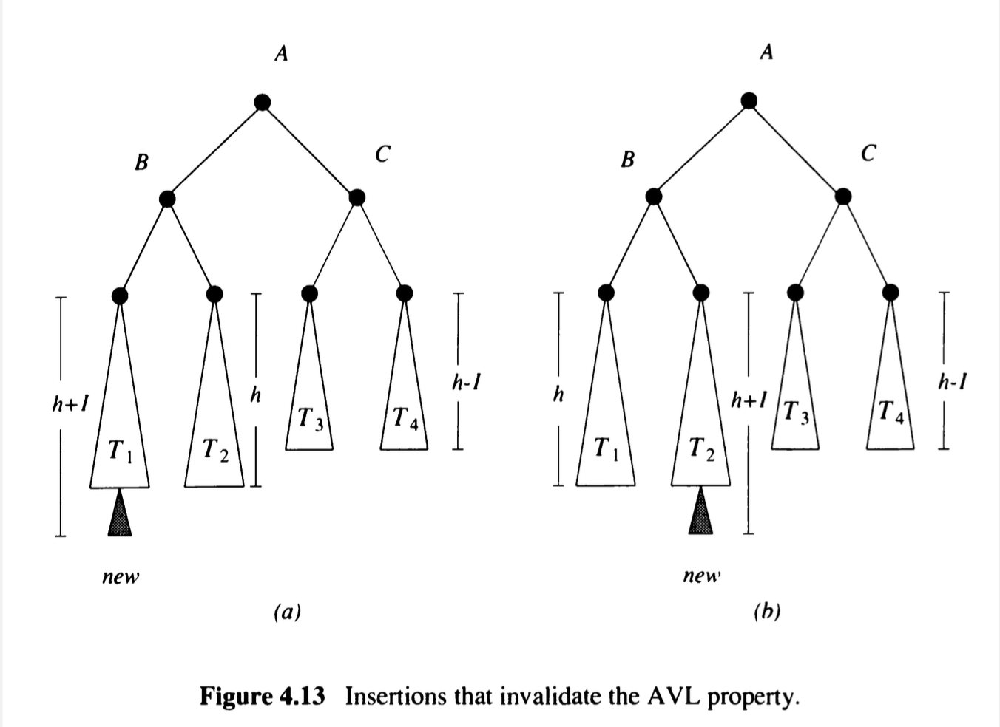
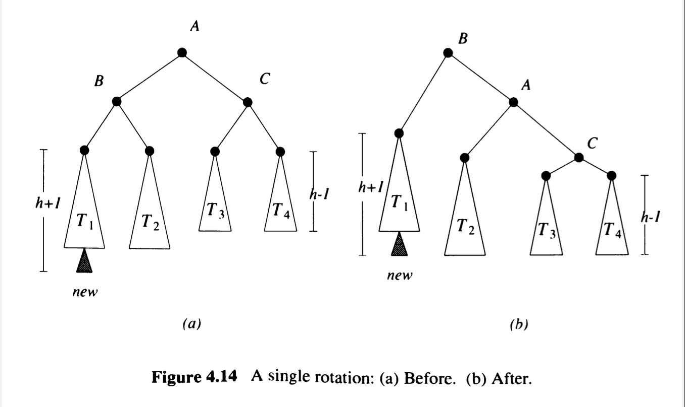
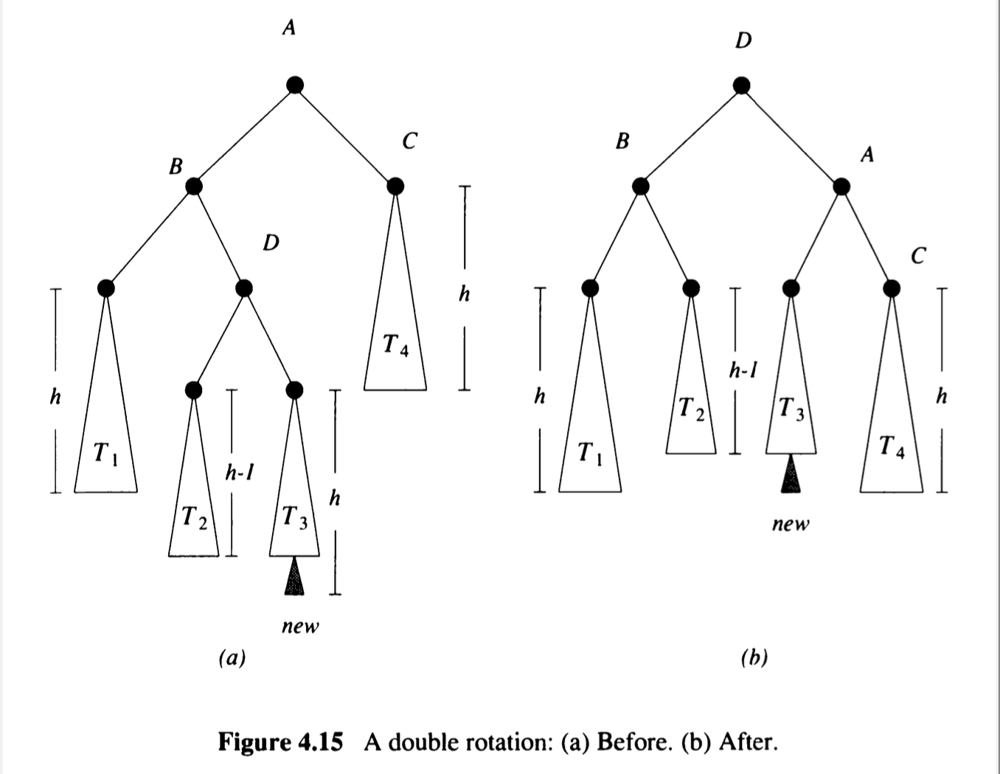
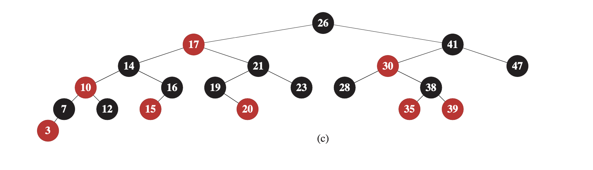

# Дървета


## Кореново дърво 1
- $(V,  p,  r)$, където:
	- $V$ - върхове
	- $p: V \setminus \lbrace r \rbrace \rightarrow V$ - функция на бащите
	- $r \in V$ - корен
- няма цикли


## Кореново дърво 2
 - $(V,  s,  r)$, където:
	- $V$ - върхове
	- $s: V \rightarrow \mathcal{P}(V)$ - функция на децата
	- $r \in V$ - корен
- няма цикли


## Представяне

```c++
struct Node {   // LeetCode
	int value;
	std::vector<Node*> children;
};
```

```c++
int nodes[] {}; // HackerRank
std::vector<int> children[] {};
```


## Обхождане в дълбочина

- рекурсивно
- итеративно
- [Maximum Depth of N-ary 
Tree](https://leetcode.com/problems/maximum-depth-of-n-ary-tree/)


## Обхождане в широчина

```c++
Node* root;
std::queue<int> queue;
queue.push(root);

while (queue.size()) {
	Node* node = queue.top(); queue.pop();
	std::cout << node->value << " ";
	
	for (Node* child: node->children) {
		if (child) {
			queue.push(child)
		}
	}
}
```


## Двоично дърво

- всеки връх има най-много 2 деца

```c++
struct Node {   // LeetCode
	int value;
	Node *left;
	Node *right;
}
```

```c++
int nodes[] {}; // HackerRank
std::pair<int, int> children[] {};
```

## Малко задачи
- [Binary Tree Level Order 
Traversal](https://leetcode.com/problems/binary-tree-level-order-traversal/description/)
- [Binary Tree Right Side 
View](https://leetcode.com/problems/binary-tree-right-side-view/)


## Двоично наредено дърво
- За всеки връх
	- върховете в лявото му поддърво са по-малки от него
	- върховете в дясното му поддърво са по-големи от него
- [Validate Binary Search 
Tree](https://leetcode.com/problems/validate-binary-search-tree/)


## Операции с BST
- търсене на елемент
- добавяне на елемент
- триене на елемент
	- имплементации (от лекция/ семинар :) )
- сложност ?


## Балансирани дървета


## AVL Tree
- BST, в което за всеки връх е изпълнено, че разликата от височините на 
лявото и дясното поддърво е -1, 0 или 1.
- височината $h$ на дървото е $\mathcal{O}(\log n)$
	- $h \le 1.4404  \log_2(n + 2) - 0.328$
- балансиране


## Unbalanced cases 




## Simple (Right) Rotation




## Double (Left-Right) Rotation 




## Red-Black Tree
- BST, за което е изпълнено, че:
	- всеки връх е червен или черен
	- коренът е черен
	- nullptr върховете са черни
	- ако връх е червен, децата му са черни
	- за всеки връх пътищата от него до листата в поддървото му имат 
равен брой черни върхове
- височината $h$ на дървото е $\mathcal{O}(\log n)$
	- $h \le 2  \log_2(n + 1)$


## Red-Black Tree




## `std::set<T>`

- `size`
- `insert`
- `erase`
- `count`
- `find`
- `upper_bound`
- `lower_bound`

## `std::map<K, V>`
- `size`
- `insert`
- `erase`
- `count`
- `find`
- `upper_bound`
- `lower_bound`
- `operator[]` 

## Задачи
- [Merge Similar 
Items](https://leetcode.com/problems/merge-similar-items/)
- [Path Sum III](https://leetcode.com/problems/path-sum-iii/)
