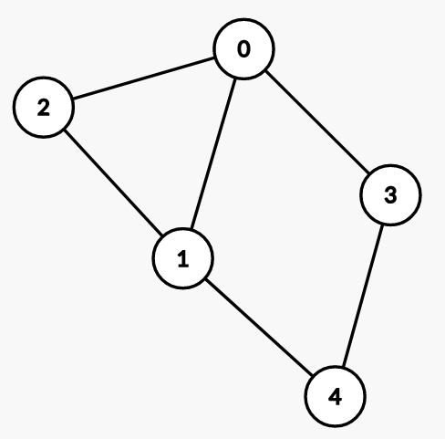
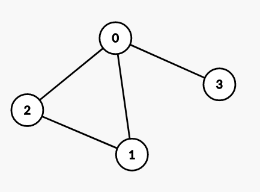
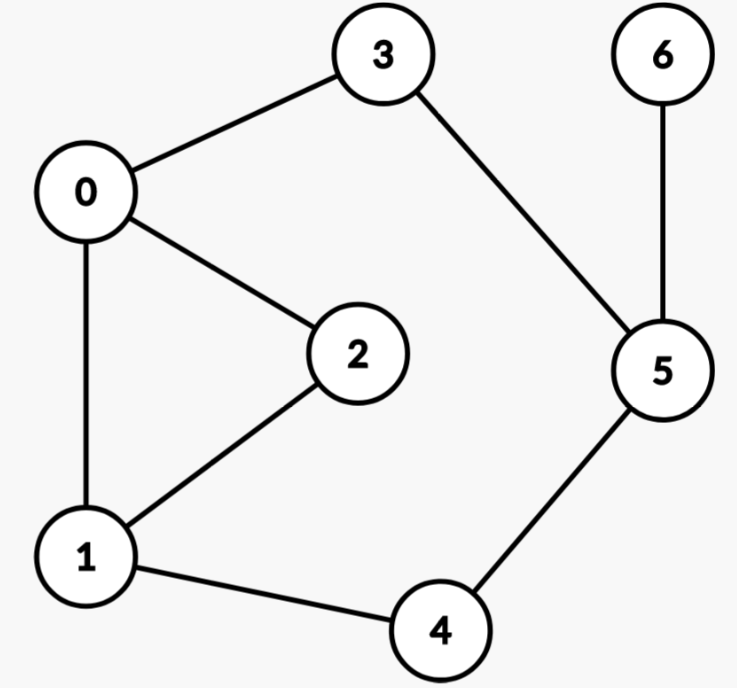

# Упражнение 10

# Oбхождане на граф

## Днес ще разгледаме

- Представяне на граф
- Обхождане в ширина на граф (BFS)
- Обхождане в дълбочина на граф (DFS)
- Топологична сортировка (Topological sorting)
- Съвети за решаване на задачи с граф
  
## Граф

Графът е нелинейна структура от данни, която представлява връзките между отделните елементи на дадено множество. Всеки член на това множество се нарича връх (*V*), а връзката между два върха се нарича ребро (*E*).

### Ориентиран граф (Directed graph)

- Всяко ребро има посока.
- Ако съществува ребро от връх А до връх В, то позволява преминаването само от А към Б.

Пример:


Съществува път от 0 до 4, но не и от 4 до 0.

### Неориентиран граф (Undirected graph)

- Ребрата нямат посока.
- Ако съществува ребро между връх А и връх Б, то позволява преминаването от А към Б и от Б към А.

Пример:



Съществува път както от 0 до 4, така и от 4 до 0.

### Претеглен граф
Граф, чиито ребра имат стойности.


### Още термини и свойста
- Цикъл - в един граф има цикъл, когато имаме път, който има дължина поне 2 и започва и свършва с един и същ връх
- Ацикличен граф - граф без цикли
- Степен (Degree) - брой ребра входящи/изходящи за даден връх
  - indegree - брой входящи ребра
  - outdegree - брой изходящи ребра
- Sparse граф - граф с ниска средна стойност на степен на върховете
- Dense граф - граф с висока средна стойност на степен на върховете
- Свързаност 
  - свързан граф - между всеки два върха в графа имаме път
  - несвързан граф - има поне два върха между които няма път
    - т.е. имаме няколко компонети на свързаност в графа
- DAG - directed acyclic graph


### Разлики с дърво
- В граф може да има цикли
- Един граф не е задължително да е свързан (т.е. между всеки два върха да има път)
- Дърветата имат йерархична подредба

## Представяне на граф

### Списък на ребрата
- Представяме графа като списък от наредени двойки
- Често се използва като input за построяване на графа


### Матрица на съседство (Adjacency matrix)

- Връзките между върховете се представят чрез булева матрица (*А*).
- Ако съществува ребро от връх *V<sub>i</sub>* до *V<sub>j</sub>*, клетката *А<sub>ij</sub> = 1*.
- Матрицата е симетрична при ненасочен граф.
- Изисква *V<sup>2</sup>* допълнителна памет.
- Позволява константа проверка дали има ребро между два върха.
- Подходящо представяне за [*dense*](https://en.wikipedia.org/wiki/Dense_graph) графи.

Пример:



```python
graph = [
    [0, 1, 1, 1],
    [1, 0, 1, 0],
    [1, 1, 0, 0],
    [1, 0, 0 ,0]
]
```

```c++
vector<vector<int>> graph = {
    {0, 1, 1, 1},
    {1, 0, 1, 0},
    {1, 1, 0, 0},
    {1, 0, 0, 0}
};
```

### Списък на съседство (Adjacency list)

- Всеки връх съдържа списък с върховете, до които има непосредствени ребра (съседите).
- Ако съществува ребро от връх *V<sub>i</sub>* до *V<sub>j</sub>*, списъкът на съседство на *V<sub>i</sub>* ще съдържа връх *V<sub>j</sub>*.
- Изисква *V + Е* допълнителна памет.
- Не предоставя константа проверка дали има ребро между два върха (*имплементацията със списък от сетове позволява).
- Подходящо представяне за *sparse* графи.
- При *dense* графи, когато *E* клони към *V<sup>2</sup>*, по-подходящо ще е представяне чрез матрица на съседство.

```python
graph = {
    '0': set([1, 2, 3]),
    '1': set([0, 2]),
    '2': set([0, 1]),
    '3': set([0])
}
```

```c++
unordered_map<int, unordered_set<int>> graph = {
    {0, {1, 2, 3}},
    {1, {0, 2}},
    {2, {0, 1}},
    {3, {0}}
};
```

### Сравнение


## Breadth First Search

Алгоритъм:
1. Разделя възлите на посетени и непосетени.
2. Започва да обхожда от подаден начален връх.
3. Добавя всички съседи, които не са посетени, към края на опашка от върхове за следващо обхождане.
4. Взима първия елемент от опашката и повтаря стъпка 3, докато има елементи в опашката.

Свойства:
- Намира най-къс път от даден възел до всички останали в непретеглен граф (всички ребра са с еднаква дължина/ тежест).
- Стои в основата на по-сложни алгоритми като Алгоритъм на Дийкстра.
- *O(V + E)* сложност по време.

```python
from collections import deque

def bfs(starting_vertex, graph):
    q = deque([starting_vertex])
    visited = set([starting_vertex])

    distance = 0

    while q:
        print(f"At distance {distance}:")
        
        for _ in range(len(q)):
            current = q.popleft()
            print(current)

            for neighbor in graph[current]:
                if neighbor not in visited:
                    visited.add(neighbor)
                    q.append(neighbor)
        
        distance += 1

bfs(0, graph)
```

```c++
void bfs(int starting_vertex, unordered_map<int, unordered_set<int>>& graph) {
    queue<int> q;
    unordered_set<int> visited;
    q.push(starting_vertex);
    visited.insert(starting_vertex);

    int distance = 0;

    while (!q.empty()) {
        int level_size = q.size();
        cout << "At distance " << distance << ":\n";

        for (int i = 0; i < level_size; ++i) {
            int current = q.front();
            q.pop();
            cout << current << "\n";

            for (int neighbor : graph[current]) {
                if (!visited.count(neighbor)) {
                    visited.insert(neighbor);
                    q.push(neighbor);
                }
            }
        }
        distance++;
    }
}
```

Пример за следния граф:



```python
# Outputs:
At distance 0:
0
At distance 1:
1
2
3
At distance 2:
4
5
At distance 3:
6

```

## Depth First Search

Алгоритъм:
1. Разделя възлите на посетени и непосетени.
2. Започва да обхожда от подаден начален връх.
3. Добавя всички съседи, които не са посетени, към края на стек* от върхове за следващо обхождане.
4. Взима първия елемент от стека и повтаря стъпка 3, докато има елементи в стека.

Свойства:
- Удобен за намиране на компоненти на свързаност, проверка за цикъл в граф и топологична сортировка. (*Забележка: Възможно е и използването на BFS за решаване на горните проблеми.)
- *O(V + E)* сложност по време.

```python
def dfs(current, visited, graph):
    print(current) # 0 1 2 4 5 3 6 

    for neighbor in graph[current]:
        if neighbor not in visited:
            visited.add(neighbor) 
            dfs(neighbor, visited, graph)
```

```c++
void dfs(int current, unordered_set<int> &visited, unordered_map<int, unordered_set<int>> &graph)
{
    cout << current << " "; // 0 3 5 6 4 1 2
    visited.insert(current);

    for (int neighbor : graph[current])
    {
        if (!visited.count(neighbor))
        {
            dfs(neighbor, visited, graph);
        }
    }
}
```

## Сравнение на обхожданията


## Топологична сортировка

- Подрежда върховете, така че всеки възел се намира преди наследниците си, към които има ребра.
- Работи за [DAG](https://en.wikipedia.org/wiki/Directed_acyclic_graph) (Directed Acyclic Graph).

[Пример:](https://leetcode.com/discuss/general-discussion/1078072/introduction-to-topological-sort)


```python
def topological_dfs(current, stack, visited, graph):
    visited.add(current)

    for neighbor in graph[current]:
        if neighbor not in visited:
            visited.add(neighbor)
            topological_dfs(neighbor, stack, visited, graph)

    stack.append(current)

def topological_sort(graph):
    stack = []
    visited = set()

    for vertex in graph:
        if vertex in visited:
            continue
        topological_dfs(vertex, stack, visited, graph)

    stack.reverse()
    return stack

topological_sort(graph_topological) # [1, 4, 2, 3, 5, 6]
```

```c++
void topological_dfs(int current, unordered_set<int> &visited, vector<int> &stack, unordered_map<int, unordered_set<int>> &graph)
{
    visited.insert(current);

    for (int neighbor : graph[current])
    {
        if (!visited.count(neighbor))
        {
            topological_dfs(neighbor, visited, stack, graph);
        }
    }
    stack.push_back(current);
}

vector<int> topological_sort(unordered_map<int, unordered_set<int>> &graph)
{
    vector<int> stack;
    unordered_set<int> visited;

    for (auto iter = graph.begin(); iter != graph.end(); ++iter)
    {
        int vertex = iter->first;
        if (!visited.count(vertex))
        {
            topological_dfs(vertex, visited, stack, graph);
        }
    }

    std::reverse(stack.begin(), stack.end());

    return stack; // 1 4 2 3 5 6
}
```

Друго възможно решение е: [1, 4, 5, 6, 2, 3].

## Допълнителни проблеми и решения на задачите

Примерни програми с разгледаните алгоритми в [Примерите](Examples/)

Имплементация на топологична сортировка с BFS, итеративно DFS и разглеждане на основни проблеми за графи в [playground-а](Examples/python_playground.ipynb). Имплементациите са на *Python*, но обясненията важат за който и да е език!

## Особености при решаване на задачи със C++

## Съвети при решаване на задачи с Python

### *Recursion depth limit*

При решаване на задачи с големи графи съществува възможност за увеличаване на ограничението за максимална дълбочина на рекурсията в Python чрез следния код:

```python
import sys
sys.setrecursionlimit(100_000)
```

### *Defaultdict* за представянето на граф

Невнимателното представянето на граф чрез *defaultdict* може да доведе до липса на самостоятелните върхове, които не са свързани с нито едно ребро. 

- Така граф, който не е свързан, поради наличието на единични самостоятелни върхове, ще изглежда свързан.
- Итерирането през всички върхове на графа може да доведе до *RuntimeError: dictionary changed size during iteration*, тъй като ще се създаде нов ключ при итерирането през децата на самостоятелен връх.
  
#### Как да избегнем проблема?

- Чрез предварително добавяне на всеки връх. Това може да се случи директно с обикновено *dictionary*.

    ```python
    graph = {node: [] for node in range(V)}
    ```

- Чрез копирването на ключовете, по които ще итерираме, в отделен списък.
  
    ```python
    for node in list(graph.keys()):
        dfs(node, graph)
    ```

[Пример](/Tasks/tasks_12/cyclic_graph) от решенията.

## Задачи за упражнение

- [Breadth First Search: Shortest Reach](https://www.hackerrank.com/challenges/bfsshortreach/problem)
- [Count of areas](https://www.hackerrank.com/contests/sda-2021-2022-test-6-christmas/challenges/challenge-2351)
- [Cyclic graph](https://www.hackerrank.com/contests/sda-homework-10/challenges/-1-12)
- [Course Schedule II](https://leetcode.com/problems/course-schedule-ii)

BFS и DFS на граф надграждат съответните имплементации за дървета, разгледани в [тема 7](/Week_06/Seminar/README.md).

