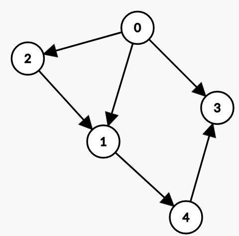
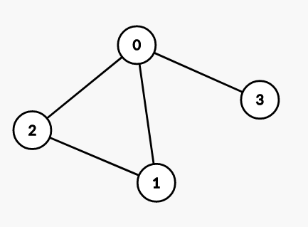
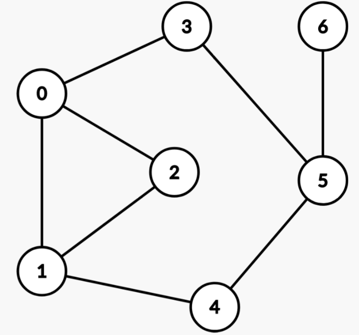

# Упражнение 11 - Графи (въведение)

**Визуализации:**

- [VisualAlgo - Graph DS](https://visualgo.net/en/graphds)
- [VisualAlgo - Graph Traversal](https://visualgo.net/en/dfsbfs)
- [CS Academy - Graph Editor](https://csacademy.com/app/graph_editor/)

## Днес ще разгледаме

- Какво е граф - основни понятия
- Представяне на граф (adjacency matrix, adjacency list, edge list)
- BFS (Breadth First Search)
- DFS (Depth First Search)
- Топологична сортировка
- Практически съвети за задачи

## Граф

Графът е нелинейна структура от данни, която представлява връзките между отделните елементи на дадено множество. Всеки член на това множество се нарича връх (_V_), а връзката между два върха се нарича ребро (_E_).

### Ориентиран граф (Directed graph)

- Всяко ребро има посока.
- Ако съществува ребро от връх А до връх В, то позволява преминаването само от А към Б.

Пример:



Съществува път от 0 до 4, но не и от 4 до 0.

### Неориентиран граф (Undirected graph)

- Ребрата нямат посока.
- Ако съществува ребро между връх А и връх Б, то позволява преминаването от А към Б и от Б към А.

Пример:


Съществува път както от 0 до 4, така и от 4 до 0.

### Претеглен граф

Граф, чиито ребра имат стойности. Стойностите се интерпретират като тегло, цена, разстояние и т.н. за преместването от един връх до друг по съответното ребро.


### Още термини и свойста

- **Цикъл** - в един граф има цикъл, когато имаме път, който има дължина поне 2 и започва и свършва с един и същ връх.
- **Ацикличен граф** - граф без цикли.
- **Степен (Degree)** - брой ребра входящи/изходящи за даден връх.
  - **indegree** - брой входящи ребра
  - **outdegree** - брой изходящи ребра
- **Sparse граф** - граф с ниска средна стойност на степен на върховете.
- **Dense граф** - граф с висока средна стойност на степен на върховете.
- **Свързаност**
  - **свързан граф** - между всеки два върха в графа имаме път.
  - **несвързан граф** - има поне два върха между които няма път.
    - т.е. имаме няколко компоненти на свързаност в графа.
- **DAG** - directed acyclic graph


### Разлики с дърво

- В граф може да има цикли.
- Един граф не е задължително да е свързан (т.е. между всеки два върха да има път).
- Дърветата имат йерархична подредба.

## Представяне на граф

### Матрица на съседство (Adjacency matrix)

- Връзките между върховете се представят чрез булева матрица (_А_).
- Ако съществува ребро от връх _V<sub>i</sub>_ до _V<sub>j</sub>_, клетката _А<sub>ij</sub> = 1_.
- Матрицата е симетрична при ненасочен граф.
- Изисква _V<sup>2</sup>_ допълнителна памет.
- Позволява константа проверка дали има ребро между два върха.
- Подходящо представяне за [_dense_](https://en.wikipedia.org/wiki/Dense_graph) графи.

Пример:



```python
graph = [
    [0, 1, 1, 1],
    [1, 0, 1, 0],
    [1, 1, 0, 0],
    [1, 0, 0 ,0]
]
```

```c++
vector<vector<int>> graph = {
    {0, 1, 1, 1},
    {1, 0, 1, 0},
    {1, 1, 0, 0},
    {1, 0, 0, 0}
};
```

### Списък на съседство (Adjacency list)

- Всеки връх съдържа списък с върховете, до които има непосредствени ребра (съседите).
- Ако съществува ребро от връх _V<sub>i</sub>_ до _V<sub>j</sub>_, списъкът на съседство на _V<sub>i</sub>_ ще съдържа връх _V<sub>j</sub>_.
- Изисква _V + Е_ допълнителна памет.
- Не предоставя константа проверка дали има ребро между два върха (\*имплементацията със списък от сетове позволява).
- Подходящо представяне за _sparse_ графи.
- При _dense_ графи, когато _E_ клони към _V<sup>2</sup>_, по-подходящо ще е представяне чрез матрица на съседство.

```python
graph = {
    '0': set([1, 2, 3]),
    '1': set([0, 2]),
    '2': set([0, 1]),
    '3': set([0])
}
```

```c++

// може и unordered_set, зависи дали ни трябва O(1) търсене дали има директен път от един връх до друг (graph[from].find(to))
unordered_map<int, vector<int>> graph = {
    {0, {1, 2, 3}},
    {1, {0, 2}},
    {2, {0, 1}},
    {3, {0}}
};
```

### Списък на ребрата

- Представяме графа като списък от наредени двойки.
- Често се използва като input за построяване на графа.
- Не е полезен в повечето задачи.

```python
graph = [
    (0, 1),
    (0, 2),
    (0, 3),
    (1, 2),
]
```

```c++
std::vector<std::pair<int, int>> graph = {
    {0, 1},
    {0, 2},
    {0, 3},
    {1, 2},
    {2, 3}
};
```

### Сравнение


## Обхождания

**Note:** BFS и DFS на граф надграждат съответните имплементации за дървета, разгледани в [тема 7](/Week_06/Seminar/README.md).

### Breadth First Search

Алгоритъм:

1. Разделя възлите на посетени и непосетени.
2. Започва да обхожда от подаден начален връх.
3. Добавя всички съседи, които не са посетени, към края на опашка от върхове за следващо обхождане.
4. Взима първия елемент от опашката и повтаря стъпка 3, докато има елементи в опашката.

Свойства:

- Намира най-къс път от даден възел до всички останали в непретеглен граф (всички ребра са с еднаква дължина/ тежест).
- Стои в основата на по-сложни алгоритми като Алгоритъм на Дийкстра.
- _O(V + E)_ сложност по време и _O(V)_ памет заради visited.

<details>
  <summary>Python code</summary>
  
```python
from collections import deque

def bfs(starting_vertex, graph):
q = deque([starting_vertex])
visited = set([starting_vertex])

    distance = 0

    while q:
        print(f"At distance {distance}:")

        for _ in range(len(q)):
            current = q.popleft()
            print(current)

            for neighbor in graph[current]:
                if neighbor not in visited:
                    visited.add(neighbor)
                    q.append(neighbor)

        distance += 1

bfs(0, graph)

````

</details>

<details>
  <summary>C++ code</summary>

```c++
void bfs(int starting_vertex, unordered_map<int, unordered_set<int>>& graph) {
    queue<int> q;
    unordered_set<int> visited;
    q.push(starting_vertex);
    visited.insert(starting_vertex);

    int distance = 0;

    while (!q.empty()) {
        int level_size = q.size();
        cout << "At distance " << distance << ":\n";

        for (int i = 0; i < level_size; ++i) {
            int current = q.front();
            q.pop();
            cout << current << "\n";

            for (int neighbor : graph[current]) {
                if (!visited.count(neighbor)) {
                    visited.insert(neighbor);
                    q.push(neighbor);
                }
            }
        }
        distance++;
    }
}
````

</details>

Пример за следния граф:



```python
# Outputs:
At distance 0:
0
At distance 1:
1
2
3
At distance 2:
4
5
At distance 3:
6

```

### Depth First Search

Алгоритъм:

1. Разделя възлите на посетени и непосетени.
2. Започва да обхожда от подаден начален връх.
3. Добавя всички съседи, които не са посетени, към края на стек\* от върхове за следващо обхождане.
4. Взима първия елемент от стека и повтаря стъпка 3, докато има елементи в стека.

Свойства:

- Удобен за намиране на компоненти на свързаност, проверка за цикъл в граф и топологична сортировка. (\*Забележка: Възможно е и използването на BFS за решаване на горните проблеми.)
- _O(V + E)_ сложност по време и _O(V)_ памет заради visited и стека.

<details>
  <summary>Python code</summary>

```python
def dfs(current, visited, graph):
    print(current) # 0 1 2 4 5 3 6

    for neighbor in graph[current]:
        if neighbor not in visited:
            visited.add(neighbor)
            dfs(neighbor, visited, graph)
```

```python
def dfs_stack(starting_vertex, graph):
    stack = [starting_vertex]
    visited = set([starting_vertex])

    while stack:
        print(stack, stack[-1])
        current = stack.pop()

        for neighbor in graph[current]:
            if neighbor not in visited:
                visited.add(neighbor)
                stack.append(neighbor)
```

</details>

<details>
  <summary>C++ code</summary>
  
```c++
void dfs(int current, unordered_set<int> &visited, unordered_map<int, unordered_set<int>> &graph) {
    cout << current << " "; // 0 3 5 6 4 1 2
    visited.insert(current);

    for (int neighbor : graph[current]) {
        if (!visited.count(neighbor)) {
            dfs(neighbor, visited, graph);
        }
    }

}

````

```c++
void dfsIterative(int start, unordered_map<int, unordered_set<int>>& graph) {
    unordered_set<int> visited;
    stack<int> s;
    s.push(start);

    while (!s.empty()) {
        int current = s.top();
        s.pop();

        if (!visited.count(current)) {
            cout << current << " ";
            visited.insert(current);

            for (int neighbor : graph[current]) {
                if (!visited.count(neighbor)) {
                    s.push(neighbor);
                }
            }
        }
    }
}
````

</details>

Важно е да се отбележи, че горният код работи за 1 компонента на свързаност. Тъй като графът може да не е свързан, трябва да направим "wrapper" функция, която да стартира бфс/ дфс/ броене на компоненти/ намиране на цикъл/ топологична сортировка от всеки връх. Ако върхът вече е бил обходен, не се извиква функцията.

<details>
  <summary>C++ code</summary>

```c++
int count_areas(const unordered_map<int, unordered_set<int>>& graph) {
    int count = 0;
    unordered_set<int> visited;
    // key - vertex
    for (const auto& kvp : graph) {
        if (visited.count(kvp.first)) continue;
        dfs(kvp.first, visited, graph);
        count++;
    }
    return count;
}

```

</details>

<details>
  <summary>Python code</summary>

```python
def count_areas(graph):
    count = 0
    visited = set()

    for vertex in graph:
        if vertex in visited:
            continue
        visited.add(vertex)

        dfs(vertex, visited, graph)
        count += 1

    return count
```

</details>

Анимиран пример с друг граф за дфс:


### Сравнение на обхожданията


### Топологична сортировка

- Подрежда върховете, така че всеки възел се намира преди наследниците си, към които има ребра.
- Работи за [DAG](https://en.wikipedia.org/wiki/Directed_acyclic_graph) (Directed Acyclic Graph).
- Задачата може да се реши чрез DFS или BFS.

За интуиция може да представим връх 2 като _Взимане на СДА_, за което са нужни връх 1 - взимане на _УП_ и връх 4 взимане на _ООП_. Връх 3 може да е _Бързи Алгоритми_, за които са нужни 1, 2 и 4, а 5 и 6 не зависят от _СДА_ и _БА_ - например _Джава_ и _Джава за Напреднали_, но стъпват на основите на _УП_ и _ООП_.

[Пример:](https://leetcode.com/discuss/general-discussion/1078072/introduction-to-topological-sort)


<details>
  <summary>Python code</summary>

```python
def topological_dfs(current, stack, visited, graph):
    visited.add(current)

    for neighbor in graph[current]:
        if neighbor not in visited:
            visited.add(neighbor)
            topological_dfs(neighbor, stack, visited, graph)

    stack.append(current)

def topological_sort(graph):
    stack = []
    visited = set()

    for vertex in graph:
        if vertex in visited:
            continue
        topological_dfs(vertex, stack, visited, graph)

    stack.reverse()
    return stack

topological_sort(graph_topological) # [1, 4, 2, 3, 5, 6]
```

</details>

<details>
  <summary>C++ code</summary>

```c++
void topological_dfs(int current, unordered_set<int> &visited, vector<int> &stack, unordered_map<int, unordered_set<int>> &graph) {
    visited.insert(current);

    for (int neighbor : graph[current]) {
        if (!visited.count(neighbor)) {
            topological_dfs(neighbor, visited, stack, graph);
        }
    }
    stack.push_back(current);
}

vector<int> topological_sort(unordered_map<int, unordered_set<int>> &graph) {
    vector<int> stack;
    unordered_set<int> visited;

    for (auto iter = graph.begin(); iter != graph.end(); ++iter) {
        int vertex = iter->first;
        if (!visited.count(vertex)) {
            topological_dfs(vertex, visited, stack, graph);
        }
    }

    std::reverse(stack.begin(), stack.end());

    return stack; // 1 4 2 3 5 6
}
```

</details>

Друго възможно решение е: [1, 4, 5, 6, 2, 3]. Връщайки се на интуитивния пример _Джава_ и _Джава за Напреднали_ нямат връзка със _СДА_ и _БА_, така че могат да бъдат разместени като групи.

Трети вариант е: [1, 4, 5, 2, 6, 3].

Тъй като не правим предварителна проверка кой от възлите е с _indegree = 0,_ за да тръгнем от него, алгоритъмът е напълно възможно да започне от връх номер 2. Това няма по никакъв начин да повлияе на правилното завършване на алгоритъма и извеждането на коректна топологична сортировка именно заради втората "wrapper" функция, която пуска _topological_dfs_ за всеки неизследван връх. Също така е напълно възможно да имаме несвързан граф, където топологичните сортировки на всяка компонента трябва да се съставят, но реда им в крайната наредба може да е произволен между тях самите.

Написаният алгоритъм в snippet-а работи само ако сме сигурни, че графът е DAG. В противен случай трябва да използваме някой от следните алгоритми:

- Алгоритъм на Кан
- DFS с маркиране

Може да ги видите като псевдокод [тук](https://en.wikipedia.org/wiki/Topological_sorting)

### Допълнителни проблеми и решения на задачите

Примерни програми с разгледаните алгоритми в [Примерите](Examples/)

Имплементация на топологична сортировка с BFS, итеративно DFS и разглеждане на основни проблеми за графи в [playground-а](playground_11.ipynb). Имплементациите са на _Python_, но обясненията важат за който и да е език!

Често срещана грешка е да не се затрива глобалната структура, която представлява графа, при наличие на много заявки - един тест с множество графи, за всеки от които трябва да се изведе резултат.

## Особености при решаване на задачи със C++

Задачите свързани с графи имат значително по-голям вход от данни, затова може да преговорите и прилагате триковете от HackerrankHacks папката качена в първия семинар. Основните две неща, които ще са ви полезни, са забързването на входа и използването на статична памет.

Практичен пример как влияе забързването на входа - разгледайте [решението](./Solutions/count_of_areas/solution_dfs_recursive.cpp).

## Съвети при решаване на задачи с Python

### _Recursion depth limit_

При решаване на задачи с големи графи съществува възможност за увеличаване на ограничението за максимална дълбочина на рекурсията в Python чрез следния код:

```python
import sys
sys.setrecursionlimit(100_000)
```

### _Defaultdict_ за представянето на граф

Невнимателното представянето на граф чрез _defaultdict_ може да доведе до липса на самостоятелните върхове, които не са свързани с нито едно ребро.

- Така граф, който не е свързан, поради наличието на единични самостоятелни върхове, ще изглежда свързан.
- Итерирането през всички върхове на графа може да доведе до _RuntimeError: dictionary changed size during iteration_, тъй като ще се създаде нов ключ при итерирането през децата на самостоятелен връх.

#### Как да избегнем проблема?

- Чрез предварително добавяне на всеки връх. Това може да се случи директно с обикновено _dictionary_.

  ```python
  graph = {node: [] for node in range(V)}
  ```

- Чрез копирването на ключовете, по които ще итерираме, в отделен списък.

  ```python
  for node in list(graph.keys()):
      dfs(node, graph)
  ```

[Пример](/Tasks/tasks_12/cyclic_graph) от решенията.

## Задачи за упражнение

### Easy

- [Find the town judge](https://leetcode.com/problems/find-the-town-judge/)
  - бонус въпрос: може ли да има двама съдии едновременно?
- [Breadth First Search: Shortest Reach](https://www.hackerrank.com/challenges/bfsshortreach/problem)

### Medium

- [Count of areas](https://www.hackerrank.com/contests/sda-2021-2022-test-6-christmas/challenges/challenge-2351)
  - [Number of provinces](https://leetcode.com/problems/number-of-provinces/description/)
- [Cyclic graph](https://www.hackerrank.com/contests/sda-homework-10/challenges/-1-12)
- [Course Schedule II](https://leetcode.com/problems/course-schedule-ii)
- [Clone graph](https://leetcode.com/problems/clone-graph/)
- [All paths from Source to Target](https://leetcode.com/problems/all-paths-from-source-to-target/)
- [Премахване на ребра](https://www.hackerrank.com/contests/sda-test5-2022-2023-43wdst52/challenges/challenge-1761/problem)

## Бонус

- [Possible Bipartition - Medium](https://leetcode.com/problems/possible-bipartition/)
  - проверка дали граф е [двуделен](https://en.wikipedia.org/wiki/Bipartite_graph)
- [Find the celebrity - Medium](https://leetcode.com/problems/find-the-celebrity/)
