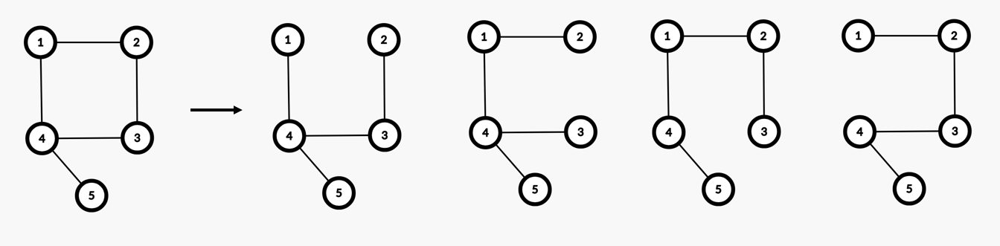
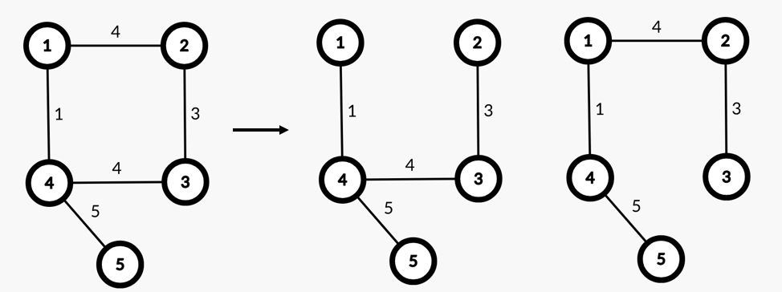
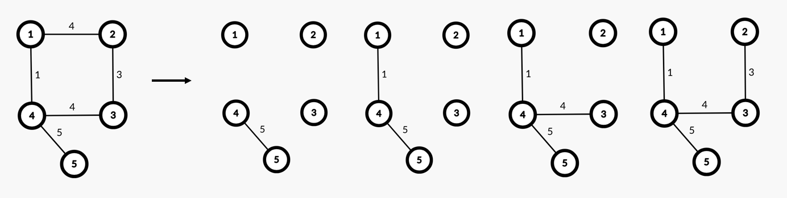
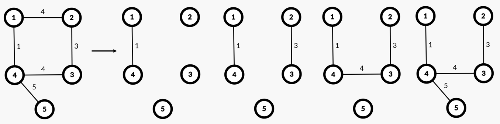

# Упражнение 14

# Минимално покриващо дърво

## Днес ще разгледаме

- Минимално покриващо дърво (Minimum spanning tree)
- Алгоритъм на Прим (Prim)
- Алгоритъм на Крускал (Kruskal)
- Disjoint-set
  
## Покриващо дърво (Spanning tree) на граф

- Дърво е свързан ацикличен насочен граф.
- Покриващо дърво на граф е дърво, подграф на дадения граф, което свързва всички възли на графа.
- Покриващото дърво на граф *G(V, E)* съдържа *V* на брой върха и *V - 1* ребра.
- Добавянето на ребро към покриващо дърво, ще създаде граф с цикъл.
- Премахването на ребро от покриващо дърво, ще създаде граф с две несвързани компоненти.



По-рядко срещано - В случай на несвързан граф имаме гора от покриващи дървета. (Spanning forest)

## Минимално покриващо дърво (Minimum spanning tree)

- Минимално покриващо дърво на претеглен ненасочен граф е покриващото дърво на графa с минимална сума на ребрата.
- Възможно е да съществува повече от 1 МПД (MST) за даден граф.
  


## Алгоритъм на Прим (Prim's algorithm)

- Намира минимално покриващо дърво на граф.
- Започва от даден връх и добавя реброто с най-малка тежест до съседен връх, който все още не е част от дървото.
- Сложността по време зависи от структурата за извличане на реброто с най-малка тежест.
- При използването на *Binary Heap* сложността е *O(E\*logV)*.

<details>
  <summary>Python code</summary>

```python
from heapq import heappush, heappop

def prim(start, V, graph):
    visited = set()
    pq = [(0, start)]
    mst_weight = 0
    
    while len(visited) != V:
        current_weight, current_vertex = heappop(pq)
        
        if current_vertex in visited:
            continue
        
        visited.add(current_vertex)
        mst_weight += current_weight
        
        for neighb, weight in graph[current_vertex]:
            if neighb in visited:
                continue
                            
            heappush(pq, (weight, neighb))
    
    return mst_weight

prim(5, 5, graph) # 13
```

</details>

Пример при започване от *връх 5*:



## Алгоритъм на Крускал (Kruskal's algorithm)

- Намира минимално покриващо дърво на граф.
- Сортира ребрата по минимална тежест, като на всяка стъпка добавя реброто с най-малка тежест, което няма да създаде цикъл в графа.
- Използва структурата *Disjoint set* за оптимална проверка за цикличност.
- Сложност по време *O(E\*logE)* заради сортирането на всички ребра.
- При *dense* граф, когато *Е = V<sup>2</sup>*, *O(ElogE) = O(ElogV<sup>2</sup>) = O(2ElogV) = O(ElogV)*

<details>
  <summary>Python code</summary>

```python
def find(x, parents):
    if parents[x] == x:
        return x
    
    furthest_parent = find(parents[x], parents)
    parents[x] = furthest_parent

    return furthest_parent

def union(x, y, parents, rank):
    x_root = find(x, parents)
    y_root = find(y, parents)

    if rank[x_root] < rank[y_root]:
        parents[x_root] = y_root
    elif rank[x_root] > rank[y_root]:
        parents[y_root] = x_root
    else:
        parents[x_root] = y_root
        rank[y_root] += 1

def kruskal(V, edges):
    edges.sort(key=lambda x: x[2])
    parents = [i for i in range(V + 1)]
    rank = [0] * (V + 1)
    mst_weight = 0

    for x, y, w in edges:
        if find(x, parents) != find(y, parents):
            mst_weight += w
            union(x, y, parents, rank)

    return mst_weight

kruskal(5 , graph_list_of_edges) # 13
```

</details>



Подробно описание как работи Disjoint-set (Union-find) структурата в [playground-а](playground_14.ipynb).

## Задачи за упражнение

- [Prim's (MST) : Special Subtree](https://www.hackerrank.com/challenges/primsmstsub/problem)
- [Kruskal (MST): Really Special Subtree](https://www.hackerrank.com/challenges/kruskalmstrsub/problem)

Решения на задачите: [тук](/Tasks/tasks_14)
