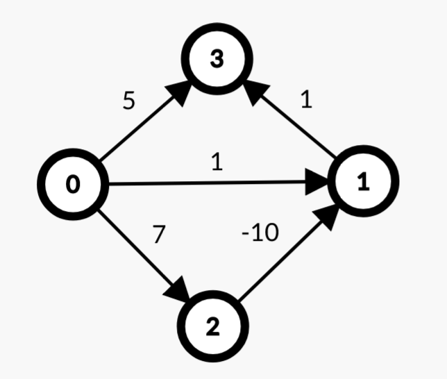

# Упражнение 11

# Най-кратък път в граф

## Днес ще разгледаме

- Претеглен граф (Weighted graph)
- Алгоритъм на Дейкстра (Dijkstra)
- Алгоритъм на Белман-Форд (Bellman-Ford)
- Най-кратък път в DAG
- Бонус

## Непретеглен граф

- Най-кратък път в непретеглен граф се намира чрез Breadth-first search (BFS).
- Не е нужно използването на по-сложни алгоритми като този на Дийкстра.
- Непретеглен граф може да се представи като претеглен такъв, където всички ребра са с равна тежест (единица).

## Претеглен граф

- Граф, при който всяко ребро има тежест.
- Тежестта може да представлява цена, разстояние, капацитет и т.н.
- Представянето може да се реализира по различни начини в зависимост какво трябва задачата. Един такъв начин е чрез списък на съседство. Всеки връх притежава списък от наредените двойки - съседен връх и тегло на реброто. Друг начин е с матрица на съседство.


```python
undirected_graph = {
    0: [(2, 7), (1, 1)],
    1: [(0, 1), (2, 8), (3, 7), (4, 2)],
    2: [(0, 7), (1, 8), (4, 3)],
    3: [(1, 7), (4, 6)],
    4: [(3, 6), (1, 2), (2, 3)]    
}
```

### Релаксация
Релаксация е ключов процес в много алгоритми за намиране на най-къс път. Тя представлява стъпка, при която разстоянието до даден връх се актуализира, ако бъде намерен по-къс път до него.

## Dijkstra's algorithm (Алгоритъм на Дейкстра)

- [Greedy](https://en.wikipedia.org/wiki/Greedy_algorithm) алгоритъм, който пресмята най-кратък път от начален връх до всички останали в претеглен граф.
- Сложността по време зависи от използваната структура.
- При използването на *Binary Heap* сложността е *O(E\*logE)*.
- Алгоритъмът не работи правилно при наличие на ребро с отрицателна тежест.


<details>
  <summary>Python code</summary>

```python
from heapq import heappop, heappush

INF = float('infinity')

def dijkstra(start, V, graph):
    distances = [INF] * V
    distances[start] = 0

    visited = set()
    
    pq = [(0, start)]
    
    while pq:
        total_weight, current = heappop(pq)
        
        if current in visited:
            continue
        visited.add(current)
        
        for neighb, added_weight in graph[current]:
            if neighb in visited:
                continue
                
            new_weight = total_weight + added_weight
            
            if distances[neighb] == INF or new_weight < distances[neighb]:
                distances[neighb] = new_weight
                heappush(pq, (new_weight, neighb))
    
    return distances

dijkstra(0, 5, undirected_graph) # [0, 1, 6, 8, 3]
```


</details>


<details>
  <summary>C++ code</summary>

```c++
struct Edge {
    int to, weight;
};

struct Node {
    int index, distance;

    bool operator<(const Node& other) const {
        return distance > other.distance;
    }
};

std::vector<int> dijkstra(int start, int V, std::unordered_map<int, std::vector<Edge>>& graph) {
    std::vector<int> distances(V, INT_MAX);
    distances[start] = 0;

    std::priority_queue<Node> nextToProcess;
    nextToProcess.push({ start, 0 });

    while (!nextToProcess.empty()) {
        auto currentNode = nextToProcess.top();
        nextToProcess.pop();

        if (currentNode.distance > distances[currentNode.index]) {
            continue;
        }

        for (const auto& edge : graph[currentNode.index]) {
            int newWeight = currentNode.distance + edge.weight;
            if (newWeight < distances[edge.to]) {
                distances[edge.to] = newWeight;
                nextToProcess.push({ edge.to, newWeight });
            }
        }
    }

    return distances;
}
 
```
  
</details>

Алгоритъм:
1. Отбелязваме всички върхове като недостижми (дистанцията до тях е безкрайност).
2. Започваме от началния връх, като дистанцията до него е 0. Маркираме го като посетен - най-кратката дистанция до него вече е намерена.
3. Изчисляваме дистанция до всеки непосетен връх, съседен на текущия, като сбор от текущата дистанция и тежестта на реброто свързваща двата върха.
4. Ако новата дистанция е по-малка от записаната за върха, обновяваме дистанцията. Добавяме в приоритетна опашка новата намерена дистанция до конкретния връх заедно с върха.
5. Взимаме върха с най-кратка дистанция от приоритетната опашка и повтаряме *стъпки 3, 4 и 5* до изчерпване на върховете в опашката. При взимане на върха от приоритетната опашка,
сме сигурни, че най-кратката дистанция до него е намерена и го бележим като посетен. Пропускаме итерация при взимането на вече посетен връх от приоритетната опашка, тъй като по-кратки пътища от него не можем да намерим.

Пример в [playground-а](./Examples/playground_11.ipynb).

## Bellman-Ford algorithm (Алгоритъм на Белман-Форд)

- Алгоритъм, който пресмята най-кратък път от начален връх до всички останали в **ориентиран** претеглен граф.
- Алгоритъмът **работи** правилно при наличие на ребро с отрицателна тежест.
- Използва подхода [Динамично оптимиране](https://en.wikipedia.org/wiki/Dynamic_programming) - свеждането на сложен проблем до набор от малки лесноразрешими проблеми.
- По-бавен алгоритъм от този на Дийкстра - сложността по време *O(VE)*
- Има свойството да открива наличие на цикъл с отрицателна дължина. При наличие на такъв цикъл в граф, не съществува най-кратък път.
- Всеки неориентиран граф, може да се представи като ориентиран такъв с цикъл. За това при наличие на отрицателно тегло в неориентирания граф, алгоритъмът няма да открие най-кратките пътища.

Пример:
```python
graph_list_of_edges = [
    (0, 1, 1), (0, 2, 7), (0, 3, 5), (1, 3, 1), (2, 1, -10),
]
```



Въпрос: Какво щеше да стане ако реброто от 0 към 1 беше насочено от 1 към 0? 

<details>
  <summary>Python code</summary>

```python
INF = float('infinity')

def bellman_ford(start, V, graph):
    distances = [INF] * V
    distances[start] = 0
    
    for _ in range(V - 1):
        for x, y, w in graph: # O(E)
            if distances[y] != INF
                distances[y] = min(distances[y], distances[x] + w)

    for x, y, w in graph: 
        if distances[x] + w < distances[y]:
            raise Exception("Graph has a negative cycle")

    return distances

bellman_ford(0, 4, graph_list_of_edges) # [0, -3, 7, -2]
```

</details>


<details>
  <summary>C++ code</summary>

```c++
struct Edge {
    int from, to, weight;
};

std::vector<int> bellman_ford(int start, int nodesCount, const std::vector<Edge>& edges) {
    std::vector<int> distances(nodesCount, INT_MAX);
    distances[start] = 0;

    for (int i = 0; i < nodesCount - 1; ++i) {
        for (const auto& edge : edges) {
            if (distances[edge.from] != INT_MAX && distances[edge.from] + edge.weight < distances[edge.to]) {
                distances[edge.to] = distances[edge.from] + edge.weight;
            }
        }
    }

    for (const auto& edge : edges) {
        if (distances[edge.from] != INT_MAX && distances[edge.from] + edge.weight < distances[edge.to]) {
            throw std::logic_error("Oh, no negative cycle...");
        }
    }

    return distances;
}
```

</details>

Интуиция: Алгоритъмът последователно намира най-кратките пътища от началния връх до всички останали с дължина 1, след това 2 и т.н. до дължина V - 1. Най-краткият път с най-много ребра без цикъл може да бъде с най-много (*V - 1*) ребра.

## Най-кратък път в DAG - използвайки топологична сортировка
Стъпки:
1. Сортираме тополочески DAG-a. 
2. Итерираме върховете по топологическия ред.
3. За всеки връх релаксираме изходящите ребра.


<details>
  <summary>C++ code</summary>

```c++

struct Edge {
    int to, weight;
};

void topologicalSort(
    int current,
    const std::unordered_map<int, std::vector<Edge>>& graph,
    std::vector<bool>& visited,
    std::stack<int>& topologicalSortStack
) {
    visited[current] = true;
    if (graph.find(current) != graph.end()) {
        for (const auto& edge : graph.at(current)) {
            if (!visited[edge.to]) {
                topologicalSort(edge.to, graph, visited, topologicalSortStack);
            }
        }
    }
    topologicalSortStack.push(current);
}

std::vector<int> dagShortedPath(int start, int V, const std::unordered_map<int, std::vector<Edge>>& graph) {
    std::vector<int> distances(V, INT_MAX);
    distances[start] = 0;

    std::stack<int> topologicalSortStack;
    std::vector<bool> visited(V, false);

    for (int i = 0; i < V; i++) {
        if (!visited[i]) {
            topologicalSort(i, graph, visited, topologicalSortStack);
        }
    }

    while (!topologicalSortStack.empty()) {
        int u = topologicalSortStack.top();
        topologicalSortStack.pop();

        if (distances[u] != INT_MAX && graph.find(u) != graph.end()) {
            for (const auto& edge : graph.at(u)) {
                if (distances[u] + edge.weight < distances[edge.to]) {
                    distances[edge.to] = distances[u] + edge.weight;
                }
            }
        }
    }

    return distances;
}

```

</details>

### Сравнение


## Задачи за упражнение

### Medium
- [Dijkstra: Shortest Reach 2](https://www.hackerrank.com/challenges/dijkstrashortreach/problem)
  - за изпробване на дийкстра
- [Network Delay Time](https://leetcode.com/problems/network-delay-time)
- [Long Long](https://www.hackerrank.com/contests/sda-hw-11/challenges/long-long)
- [Path with Maximum Probability](https://leetcode.com/problems/path-with-maximum-probability)
- [Cheapest Flights Within K Stops](https://leetcode.com/problems/cheapest-flights-within-k-stops/)

### Hard
- [Minimum Obstacle Removal to Reach Corner](https://leetcode.com/problems/minimum-obstacle-removal-to-reach-corner/)
  - дийкстра в матрицата
  - напълно аналогични задачи
    - [Minimum Cost to Make at Least One Valid Path in a Grid](https://leetcode.com/problems/minimum-cost-to-make-at-least-one-valid-path-in-a-grid)
    - [Path With Minimum Effort - Medium](https://leetcode.com/problems/path-with-minimum-effort/)

## Бонус
- Защо O(logV)~O(logE) (не мултиграф)
- Друг алгоритъм за намиране на най-кратък път между всички възможни двойки от върхове - [Floyd-Warshall](https://en.wikipedia.org/wiki/Floyd%E2%80%93Warshall_algorithm)
	- може да го изпобвате - https://www.hackerrank.com/challenges/floyd-city-of-blinding-lights/problem
- [0-1 BFS (Shortest Path in a Binary Weight Graph)](https://www.geeksforgeeks.org/0-1-bfs-shortest-path-binary-graph/)

