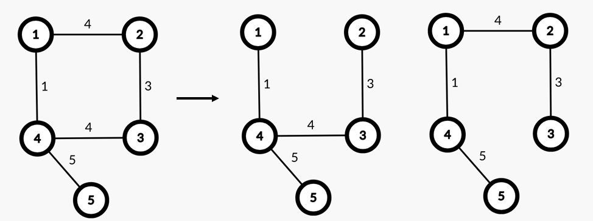

# Упражнение 12

# Минимално покриващо дърво

## Днес ще разгледаме

- Минимално покриващо дърво (Minimum spanning tree)
- Алгоритъм на Прим (Prim)
- Disjoint-set
- Алгоритъм на Крускал (Kruskal)
  
## Покриващо дърво (Spanning tree) на граф

- Дърво е свързан ацикличен свързан граф.
- Покриващо дърво на граф е дърво, подграф на дадения граф, което свързва всички възли на графа.
- Покриващото дърво на граф *G(V, E)* съдържа *V* на брой върха и *V - 1* ребра.
- Добавянето на ребро към покриващо дърво, ще създаде граф с цикъл.
- Премахването на ребро от покриващо дърво, ще създаде граф с две несвързани компоненти.


По-рядко срещано - В случай на несвързан граф имаме гора от покриващи дървета. (Spanning forest)

## Минимално покриващо дърво (Minimum spanning tree)

- Минимално покриващо дърво на претеглен ненасочен граф е покриващото дърво на графa с минимална сума на ребрата.
- Възможно е да съществува повече от 1 МПД (MST) за даден граф.
  


## Свойство на минималния разрез (Cut property)
- Нека имаме граф G(V, E) и някакво разделяне на върховете му на две непразни множества S и V\S.
- Нека e да е реброто с най-малка тежест, което свързва върховете от S с върховете от V\S.
- Тогава съществува минимално покриващо дърво, което съдържа реброто e.

## Алгоритъм на Прим (Prim's algorithm)

- Намира минимално покриващо дърво на граф.
- Започва от даден връх и добавя реброто с най-малка тежест до съседен връх, който все още не е част от дървото.
- Сложността по време зависи от структурата за извличане на реброто с най-малка тежест.
- При използването на *Binary Heap* сложността е *O(E\*logE)*. (При използване на друг вид heap може да достигне до *O(E\*logV)*)

<details>
  <summary>Python code</summary>

```python
from heapq import heappush, heappop

def prim(start, V, graph):
    visited = set()
    pq = [(0, start)]
    mst_weight = 0
    
    while len(visited) != V:
        current_weight, current_vertex = heappop(pq)
        
        if current_vertex in visited:
            continue
        
        visited.add(current_vertex)
        mst_weight += current_weight
        
        for neighb, weight in graph[current_vertex]:
            if neighb in visited:
                continue
                            
            heappush(pq, (weight, neighb))
    
    return mst_weight

prim(5, 5, graph) # 13
```

</details>


<details>
  <summary>C++ code</summary>

```c++
#include <vector>
#include <unordered_map>
#include <unordered_set>
#include <queue>

struct Edge {
    int from;
    int to;
    int weight;

    bool operator<(const Edge& other) const {
        return weight > other.weight;
    }
};
// we assume that the graph is represented as an adjacency list
std::vector<Edge> prim(int n, int start, std::unordered_map<int, std::vector<Edge>>& graph) {
    std::priority_queue<Edge> pq;
    std::unordered_set<int> visited;
    pq.push({ start, start, 0 });

    std::vector<Edge> mstEdges;

    while (!pq.empty() && visited.size() < n) { // visited.size() < n to stop earlier if the mst is ready
        auto current = pq.top();
        pq.pop();
        if (visited.count(current.to)) {
            continue;
        }

        visited.insert(current.to);
        mstEdges.push_back(current);
        for (auto& adj : graph[current.to]) {
            if(visited.count(adj.to)) {
                continue;
            }
            pq.push(adj);
        }
    }

    return mstEdges;
}

// if we are not if the graph is connected
void test() {
        auto mstEdges = prim(n, 1, graph);
        // if the graph is not connected we will have less than n - 1 edges
        // mstEdges.size() - 1 because of the extra edge
        if(mstEdges.size() - 1 < n - 1 ) {
            return -1;
        }

        int result = 0;
        for(size_t i = 1 ; i < mstEdges.size(); i++) {
            result += mstEdges[i].weight;
        }
        return result;
}


// if we are sure that the graph is connected, we can directly do the calculations inside the algorithm
int prim2(int n, int start, std::unordered_map<int, std::vector<Edge>>& graph) {
    std::priority_queue<Edge> pq;
    std::unordered_set<int> visited;
    pq.push({ start, start, 0 }); // fake edge to start the algorithm

    int totalWeight = 0;

    while (!pq.empty() && visited.size() < n) {  // visited.size() < n to stop earlier if the mst is ready
        auto current = pq.top();
        pq.pop();
        if (visited.count(current.to)) {
            continue;
        }

        visited.insert(current.to);
        totalWeight += current.weight;
        for (auto& adj : graph[current.to]) {
            if(visited.count(adj.to)) {
                continue;
            }
            pq.push(adj);
        }
    }

    return totalWeight;
}
```

</details>

Пример при започване от *връх 5*:


- Имплементацията наподобява тази на алгоритъма на Дийкстра с разликата, че приоритетната опашка държи ребра, а не двойка връх и изминат път от началото до него.
- В случай, че искаме да поддържаме гора от MST трябва да променим имплементацията

## Disjoint-set структура от данни (Union find data structure)
Структура от данни предназначена за работа с несвързани множества. Две множества са несвързани, ако нямат общи елементи ({1, 2} и {3, 4}).
Относно структурата - първоначално инициализира всеки елемент да бъде в свое собствено множество.
Поддържа две основни операции:
- Проверка дали два елемента са в едно множество
- Да обедини множествата на два елемента 

Пример от реалния живот - редене на пъзел.

Структурата е удобна за използване в алгоритъм на Крускал. Сложността за обединяване на N елемента е О(N*α(N)), където α е обратната функцията на Акерман.

Подробно описание как работи Disjoint-set (Union-find) структурата в [playground-а](playground_12.ipynb). (Имплементацията в playground-а е на Python)
Аналогична C++ имплементация има в съответната папка.

На следния линк можете да разцъкате как се променя масив с родители на база кои оптимизации са включени и изключени [Disjoint-set visualization](https://www.cs.usfca.edu/~galles/visualization/DisjointSets.html)

## Алгоритъм на Крускал (Kruskal's algorithm)

- Намира минимално покриващо дърво на граф.
- Сортира ребрата по минимална тежест, като на всяка стъпка добавя реброто с най-малка тежест, което няма да създаде цикъл в графа.
- Използва структурата *Disjoint set* за оптимална проверка за цикличност.
- Сложност по време *O(E\*logE)* заради сортирането на всички ребра.
- При *dense* граф, когато *Е = V<sup>2</sup>*, *O(ElogE) = O(ElogV<sup>2</sup>) = O(2ElogV) = O(ElogV)*

<details>
  <summary>Python code</summary>

```python
def find(x, parents):
    if parents[x] == x:
        return x
    
    furthest_parent = find(parents[x], parents)
    parents[x] = furthest_parent

    return furthest_parent

def union(x, y, parents, rank):
    x_root = find(x, parents)
    y_root = find(y, parents)

    if rank[x_root] < rank[y_root]:
        parents[x_root] = y_root
    elif rank[x_root] > rank[y_root]:
        parents[y_root] = x_root
    else:
        parents[x_root] = y_root
        rank[y_root] += 1

def kruskal(V, edges):
    edges.sort(key=lambda x: x[2])
    parents = [i for i in range(V + 1)]
    rank = [0] * (V + 1)
    mst_weight = 0

    for x, y, w in edges:
        if find(x, parents) != find(y, parents):
            mst_weight += w
            union(x, y, parents, rank)

    return mst_weight

kruskal(5 , graph_list_of_edges) # 13
```

</details>

<details>
  <summary>C++ code</summary>

```c++
struct Edge {
    int from;
    int to;
    int weight;
};

// we use the interface
class UnionFind {
public:
    UnionFind(size_t vertices);

    bool areInOneSet(size_t first, size_t second);
    void unionVertices(size_t first, size_t second);
};

std::vector<Edge> kruskal(int n, std::vector<Edge>& edges) {
    std::sort(edges.begin(), edges.end(), [](const Edge& a, const Edge& b) {
        return a.weight < b.weight;
    });
    UnionFind uf(n);
    std::vector<Edge> mstEdges;
    for (size_t i = 0; i < edges.size(); i++) {
        if (uf.areInOneSet(edges[i].from, edges[i].to)) {
            continue;
        }

        uf.unionVertices(edges[i].from, edges[i].to);
        mstEdges.push_back(edges[i]);
        if (mstEdges.size() == n - 1) {
            break;
        }
    }

    return mstEdges;
}
```

</details>


Крускал поддържа гора от покриващи дървета с леки промени в имплементацията.

## Задачи за упражнение

// TODO: .... next week

## Бонус
[Prim vs Kruskal for sparse and dense graphs](https://medium.com/@dilkyliyanage/implementation-efficiency-comparison-of-mst-algorithms-9993953b1307)
