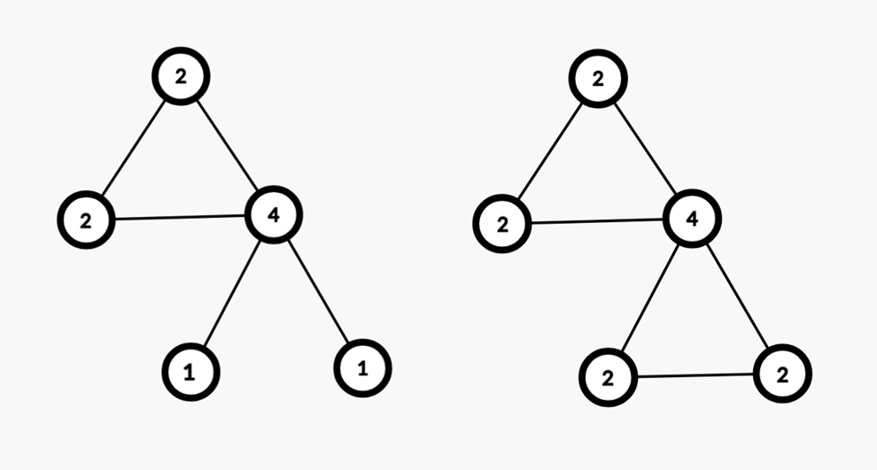
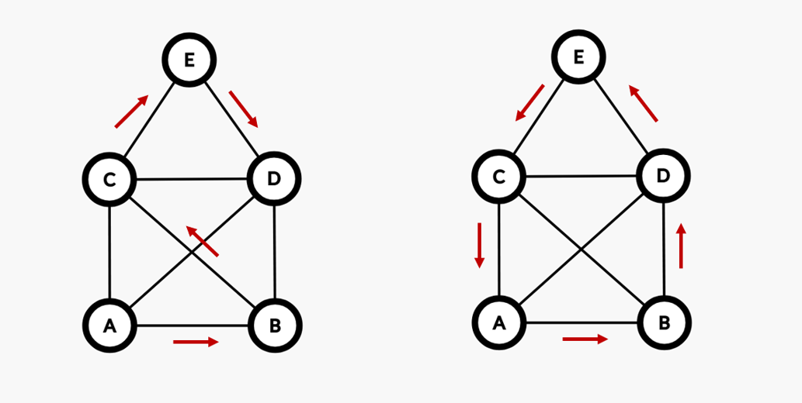

# Упражнение 13

# Ойлеров и Хамилтонов път в граф

## Днес ще разгледаме

- Ойлеров път в граф (Eulerian path)
- Хамилтонов път в граф (Hamiltonian path)
- NP, NP complete, NP hard проблеми
  
## Ойлеров път и Ойлеров цикъл 

### Ойлеров път (Eulerian path)

- Ойлеровият път минава през всяко едно **ребро** на даден граф само по един път.
- Допуска се преминаването през даден възел повече от един път.
- Граф притежава Ойлеров път, ако има **точно 2 възела** с **нечетна** степен.
- Степен на връх е броя на ребрата, чрез които той е свързан с другите върхове.
- Ойлеровият път винаги започва от един от върховете с нечетна степен и приключва в другия.

### Ойлеров цикъл (Eulerian cycle)

- Частен случай на Ойлеровия път.
- Ойлеровият цикъл е път, който минава през всяко едно **ребро** на даден граф само по един път, като свършва във върха, от който е тръгнал.
- Граф притежава Ойлеров цикъл, ако **всички** възли в графа са от четна степен.
- Цикълът може да започне от който и да е възел.

## Хамилтонов път и Хамилтонов цикъл

### Хамилтонов път (Hamiltonian path)

- Хамилтоновият път минава през всеки един **връх** на даден граф само по един път.
- Не е нужно да използва всяко едно ребро за построяване на пътя.
- Проверката дали граф има Хамилтонов път/ цикъл е *NP complete problem*

### Хамилтонов цикъл (Hamiltonian cycle)

- Частен случай на Хамилтоновия път.
- Хамилтоновият цикъл е път, който минава всеки един **връх** на даден на даден граф само по един път, като свършва във върха, от който е тръгнал.
- Проблемът за намирането на минимален Хамилтонов цикъл е известен като *The Traveling Salesman Problem* (*NP hard problem*).

Пример за Хамилтонов път - *ABCED*, за Хамилтонов цикъл - *ABDECA*.

## P, NP, NP complete, NP hard проблеми

### Complexity class P 

- Проблеми, които **могат** да се **решат** за полиномиално време.
- Сложността на решението може да се представи като *O(Nk)* за някое *k*.
- Включва константна, квадратична, енлог сложност. (*O(1) = O(N0), O(NlogN) < O(N2)*)
- Съществува ли Ойлеров път в граф е проблем от *class P*.
  
### Complexity class NP 

- Проблеми, които **не могат** да се **решат** за полиномиално време.
- Все още не съществува доказателство, че *P = NP*, нито че *P != NP*.
- За полиномиално време може да се **провери** дали предложено решение е валидно.
- Примери за неполиномиални сложности са *2N, 3N, N!, N!NlogN* и т.н.
- Съществува ли Хамилтонов път в граф е проблем от *class NP*.

*1 < logN < sqrtN < N < NlogN < N2 < N3 < 2N < 3N < N! < NN*

### Complexity class NP complete

- Подмножество от всички *NP* проблеми (подмножество и на *NP hard* проблемите).
- Един *NP complete* проблем може да се преобразува в друг такъв за полиномиално време.
- Ако се намери полиномиално решение на един *NP complete* проблем, то решава всеки един *NP complete* проблем за полиномиално време.
- [Примери](https://en.wikipedia.org/wiki/List_of_NP-complete_problems): Съществува ли Хамилтонов път в граф и Най-дълъг път в граф са проблеми от *NP complete*.

### Complexity class NP hard

- Всички проблеми, които са поне толкова сложни, колкото най-сложните проблеми от *NP* класа.
- Дори да се предложи решение, **не винаги е възможно** да се провери за полиномиално време дали то е валидно. (Възможно е при *NP complete* проблем)
- Намиране на бързо решение за всички *NP complete* проблеми, не означава намиране на бързо решение за всички *NP hard* проблеми.
- *The Traveling Salesman Problem* е пример за *NP hard* проблем - дори да се предложи решение за най-кратък Хамилтонов цикъл не може лесно да се провери дали наистина то е оптималното.

## Задачи за упражнение

- [The Islander](https://www.hackerrank.com/contests/sda-hw-13-2022/challenges/islander/problem)
- [Permutations](https://leetcode.com/problems/permutations)
- [All Paths From Source to Target](https://leetcode.com/problems/all-paths-from-source-to-target)
- [Reconstruct Itinerary](https://leetcode.com/problems/reconstruct-itinerary)
  - подобна [Valid Arrangement of Pairs](https://leetcode.com/problems/valid-arrangement-of-pairs/)

## Бонус: Trie

TODO: ....

### Trie задачи
- [Implement prefix trie](https://leetcode.com/problems/implement-trie-prefix-tree/description/)
  - follow up:
    - ако искам бройка? брой думи равни на търсената? брой думи започващи с даден prefix?
    - как ще се грижим за паметта?
- [Design Add and Search words data structure](https://leetcode.com/problems/design-add-and-search-words-data-structure/)
